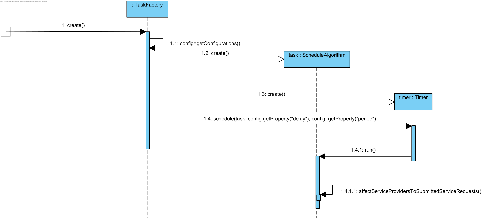
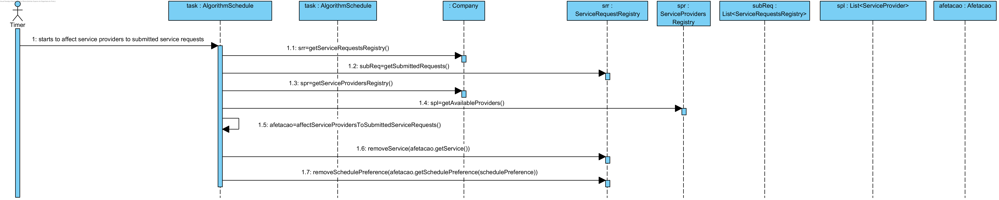
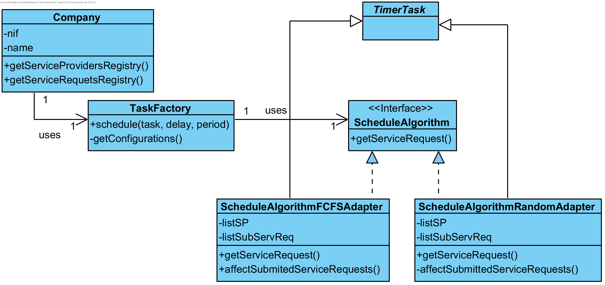

# UC10 Affect Service Providers Realization

## Rational

| Main flow                                                                                        | Question: Which Class...                                      | Answer                                      | Justification                                                                                                         |
|:-------------------------------------------------------------------------------------------------------|:------------------------------------------------------------|:-----------------------------------------------|:---------------------------------------------------------------------------------------------------------------------|
| 1. Timer starts to affect service providers to submitted service requests. |
|       | ...creates task? | TaskFactory | Creator (Rule 1). |
|       | ...creates Timer? | TaskFactory | Creator (Rule 1). |
| 2. The system selects the submitted service requests according to schedule algorithms (FCFS or Random). | ...creates the algorithm | TaskFactory | Creator (Rule 1). |
|       | ...knows the algorithms? | Company | IE: In MD Company uses ScheduleAlgorithm|
|       | ...provides the affectation | ScheduleAlgorithm | IE: In MD ScheduleAlgorithm provides that information |
|       | ...implements the characteristics of each algorithm? | AlgorithmFCFSAdapter or AlgorithmRandomAdapter | ProtectedVariation + Adapter |
|       | ...creates affectation? | AffectationRegistry | HC+LC and Creator (Rule 1). |

## Systematization ##

 From the rational results that the classes promoted to software classes are:

 * Company
 * ScheduleAlgorithm
 * Affectation

Other indentified software classes (i.e. Pure Fabrication) are:  

 * TaskFactory
 * AlgorithmFCFSAdapter
 * AffectationRegistry

##	Sequence Diagram

##	Class Diagram

