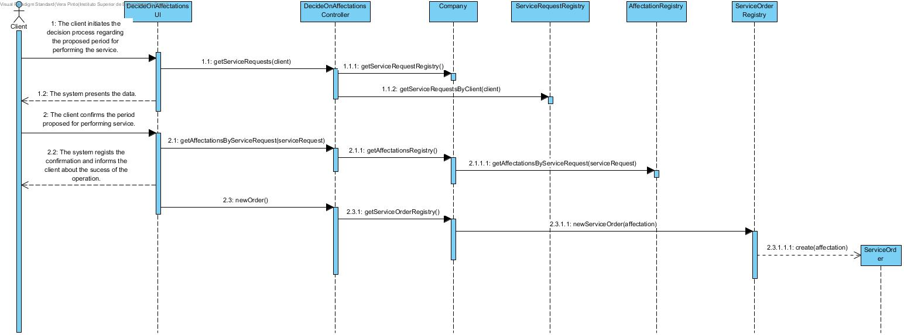
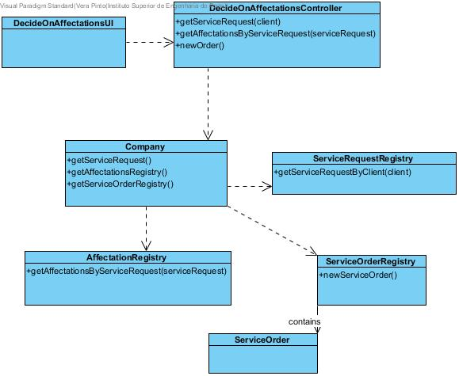

# Realization of UC11 Decide on the proposed period for services

## Rational

| Main Flow                                                                                        | Question: Which class...                                      | Answer                                       | Justification                                                                                                         |
|:-------------------------------------------------------------------------------------------------------|:------------------------------------------------------------|:-----------------------------------------------|:---------------------------------------------------------------------------------------------------------------------|
|1. The client initiates the decision process regarding the proposed period for performing the service. |... interacts with the user?|DecideOnTheProposedPeriodoForServicesUI|Pure Fabrication|
||...coordenates the UC?|DecideOnTheProposedPeriodoForServicesController|Controller
||...knows all the instances of service provider and clients?|Company|IE: contains all the service providers and clients.|
||...saves the service orders?|ServiceOrdersRegistry|Creator + HCLC|
| |... knows every schedule introduced by client? | SchedulePreference | IE: knows all schedule preferences from all clients.|
||... knows every service request?| ServiceRequestRegistry | IE + LC: knows every service request from all clients.
|2. The system presents the data.| ...knows every affectation? | AffectationRegistry| IE + LC : knows every affectation.|
|3. The client confirms the period proposed for performing service.| |  |  |
|4. The system regists the confirmation and informs the client about the sucess of the operation.|...generates the service orders to the service providers?| ServiceOrdersRegistry| IE + LC: knows every service order done by the clients.|

## Sistematization

From rational results the following conceptual classes that were promoved to software classes:

 * Company
 * Client
 * SchedulePreference

Another software classes (i.e. Pure Fabrication) identified:

 * DecideOnTheProposedPeriodoForServicesUI
 * DecideOnTheProposedPeriodoForServicesController
 * ServiceOrdersRegistry
 * ServiceRequestRegistry

##	Sequence Diagram

##	Class Diagram

