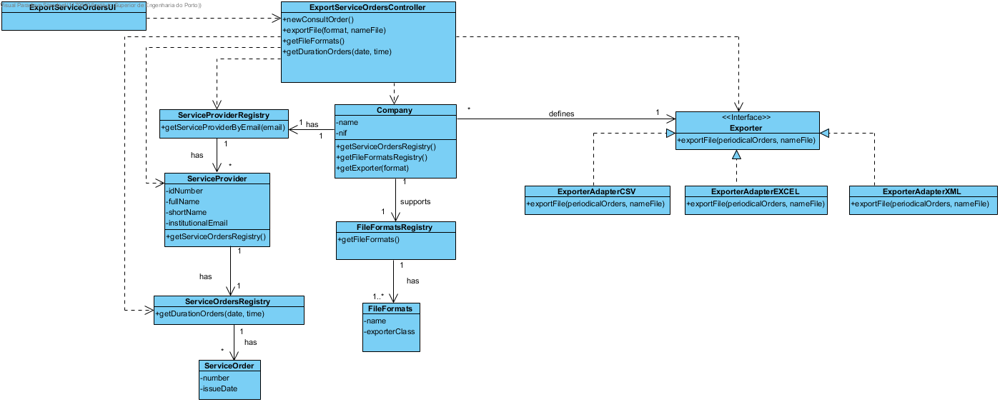

# Realization of the UC12 - ConsultServiceOrders

## Racional

| Main Flow                                            | Question: Which class...                                    | Answer   | Justification                                                                                     |
|:-------------------------------------------------------------------------------------------------------|:------------------------------------------------------------|:-----------------------------------------------|:---------------------------------------------------------------------------------------------------------------------|
| 1. The services provider starts to consult the service orders.| ...interacts with the user? | ExportServiceOrdersUI | Pure Fabrication |
| | ...coordinates the UC? |ExportServiceOrdersController|Controller|
| | ...know the ServiceProvider's class?|ServiceProviderRegistry| HC + LC |
| 2. The system requests the service order period. | | ||
| 3. The service provider enters the requested data.|... saves the entered data?|ExportServiceOrdersController|Controller|
| 4. The system shows available file formats to export, requests one and the name of the file. | ...knows the service execution orders of the service provider?| ServiceOrdersRegistry | IE: ServiceOrdersRegistry aggregate ServiceOrders|
| | ...knows the existing file formats? | FileFormatsRegistry | IE: FileFormatsRegistry aggregate FileFormats |
| 5. The service provider selects the desired file format and enters the name.| ...saves the selected type of format? | Company | Information Expert: In the domain model, company defines the exporter Protected Variation on the Exporter because the system must support several exporters of files.
||... saves the name of the file?|ExportServiceOrdersController| Controller
| 6. The system exports the file and informs the service provider of the success of the operation. | ... provides the file in the specific format? | Exporter | IE: In the domain model the exporter provides that information |
| | ...implements the specifications of each file format? | ExporterFileXXXAdapter | ProtectedVariation + Adapter |
| | ...notifies the user? | ExportServiceOrdersUI | | |

## Sistematização ##

From the rational, the resulting conceptual classed promoted to software classes are:
 * Company
 * ServiceProvider
 * ServiceExecutionOrder
 * FileFormat
 * Exporter

Other software classes identified (i.e. Pure Fabrication):

 * ServiceProvidersRegistry
 * ServiceOrdersRegistry
 * FileFormatsRegistry

## Sequence Diagram

## Class Diagram
