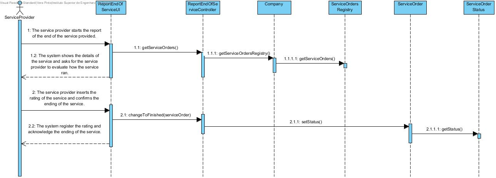
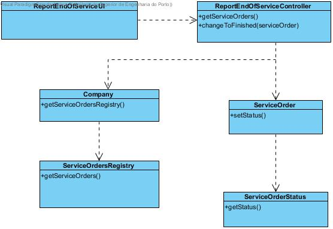

# Realization of the UC13 - Report the end of the service provided

## Rational

| Main Flow                                            | Question: Which class...                                    | Answer   | Justification                                                                                     |
|:-------------------------------------------------------------------------------------------------------|:------------------------------------------------------------|:-----------------------------------------------|:---------------------------------------------------------------------------------------------------------------------|
| 1. The service provider starts the report of the end of the service provided.  | ...interacts with the user? | ReportEndOfTheServiceProvidedUI | Pure Fabrication |
| | ...coordinates the UC? | ReportEndOfTheServiceProvidedController | Controller|
| | ...knows the ServiceOrders?| ServiceOrdersRegistry| HC + LC |
| | ...knows the ServiceProvider?| ServiceProvidersRegistry| HC + LC |
| | ...knows the ServiceOrdersRegistry?| Company | HC + LC |
| 2. The system shows the details of the service and asks for the service provider to evaluate how the service ran. | | ||
| 3. The service provider inserts the rating of the service and confirms the ending of the service. |... knows every execution order? | ServiceProvider | Information Expert (IE)|
|| ... generates the service orders to the service providers?| ServiceOrderRegistry| IE + LC: knows every service provider and contains every service order.|
| 4. The system register the rating and acknowledge the ending of the service.|||||

## Sistematization

From the rational, the resulting conceptual classes promoted to software classes are:
* ServiceProvider
* Company

Other software classes identified (i.e. Pure Fabrication):
* ReportTheEndOfTheServiceProvidedUI
* ReportTheEndOfTheServiceProvidedController
* ServiceProviderRegistry
* ServiceOrdersRegistry

## Sequence Diagram

## Class Diagram

