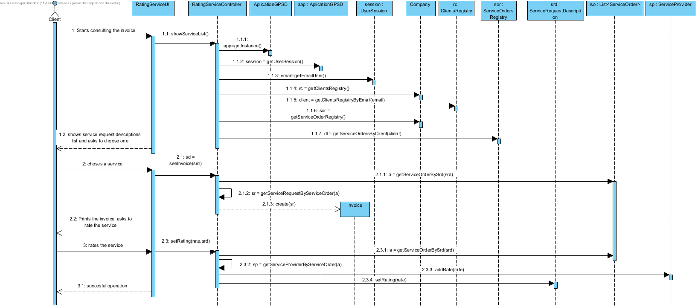
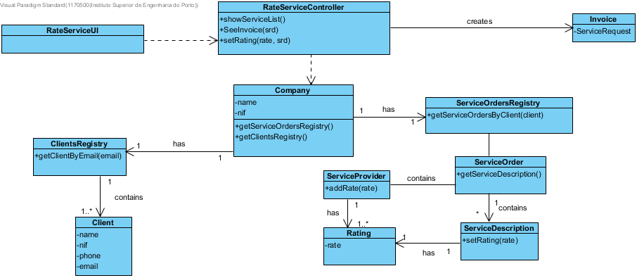

Realization of the UC14 - Rating a service
=============================================================

Racional
--------

| Main flow                                                                                                | Question: Which class...                                 | Answer                   | Justification                                                                                                         |
|------------------------------------------------------------------------------------------------------------------|------------------------------------------------------------|-------------------------------|------------------------------------------------------------------------------------------------------------------------|
| 1. The Client starts consulting the invoice.                                    | ...interacts with the user?                              | RatingServiceUI|PureFabrication, because it isn't justified to assign this responsability to any existent class in the domain model. |
|                                                                                                                  | ...coordinates the UC?                                          | RatingServiceController|Controller                                                                                                             |
|                                                                                                                  | ...knows the serivce orders?                            | ServiceOrdersRegistry | IE: The ServiceOrdersRegistry aggregates Service Orders|
| 2. The System shows the service list and asks to choose one..   | n/a                                                        |                               |                                                                                                                        |
| 3. The Client chooses a service.                                                   | ...creates Invoice? | Invoice |  Creator(Rule 1)                                                              |
| 4. The System shows the Invoice and asks the client to rate the service.                                                                        | n/a                                                        |                               |                                                                                                                        |
| 5. The Client rates the service.                                                        | ...saves the rating?                        | Rating | Information Expert (IE) - Instance created in this step.                                                                                                     |
|                                                                                                                  6. The system registers the rating and informs the client of the success of the operation. | ... saves the Rating instance previously created?   | ServiceDescription | Information Expert (IE) -  ServiceDescription contains a Rating                             
||... saves the Rating instance previously created?|ServiceProvider| Information Expert (IE) - ServiceProvider contains a list of ratings |
| | ...informs the unregistered user?                   | RatingServiceUI         |                                                                                                                        |

Systematization
--------------
From the rational, the resulting conceptual classed promoted to software classes are:

-   Company

-   Rating
-  Invoice
- ServiceProvider
- ServiceRequestDescription
 
Other software classes identified (i.e. Pure Fabrication)

-   RatingServiceUI

-   RatingServiceController

- ClientsRegistry
- ServiceOrdersRegistry

Sequence Diagram
---------------------

Class Diagram
-------------------

