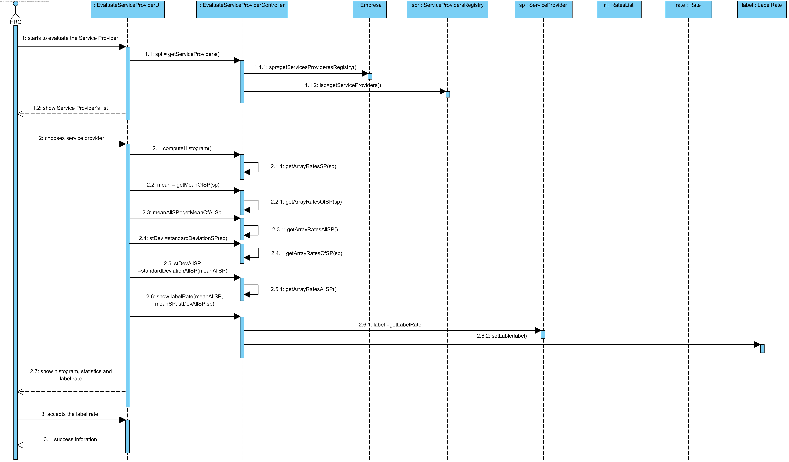
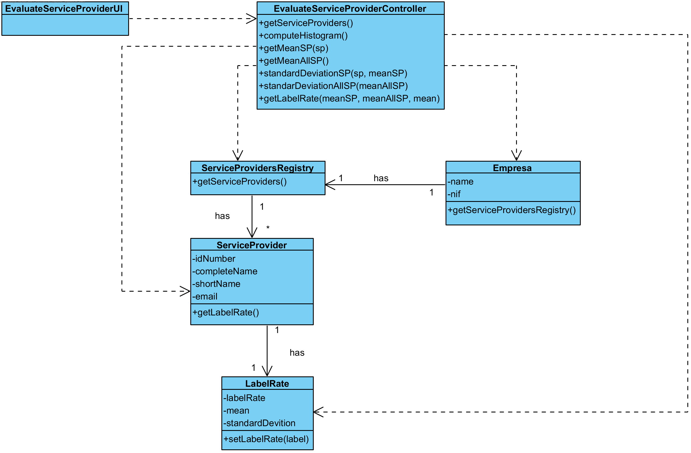

# UC15 Evaluate Service Provider Realization

## Rational

| Main flow                                                                                        | Question: Which Class...                                      | Answer                                      | Justification                                                                                                         |
|:-------------------------------------------------------------------------------------------------------|:------------------------------------------------------------|:-----------------------------------------------|:---------------------------------------------------------------------------------------------------------------------|
| 1. The HRO starts to evaluate the Service Provider. | ...interacts with the user?| EvaluateServiceProviderUI| PureFabrication |
||...coordinates the UC?|EvaluateServiceProviderController| Controller |
||...creates LabelRate?|ServiceProvider| Creator (Rule 1) |
|2. The system presents a list of all Service Providers. | ...knows all the service providers? | ServiceProvidersRegistry| HC + LC |
|3. The HRO chooses a Service Provider | | | |
|4. The system shows the statistics with the performance of each Service Provider and all Service Providers, a histogram showing Service Providers rating distribution and a label to each service provider. | ...knows all the rates of the services executed by service providers? | ServiceProviders | IE: ServiceProvider has a list of rates |
|| ...saves the information of the label and statistics? | LableRate | IE: LableRate has his own data. |
| 5. The HRO decides to accepts the label given to the Service Provider. | | | |
| 6. The system saves the labels and sends a success message. | ...saves the label? | ServiceProvider | IE: In MD ServiceProvider has his own label. |

## Systematization ##

 From the rational results that the classes promoted to software classes are:

 * Company
 * ServiceProvidersRegistry
 * ServiceProvider
 * Rate
 * LabelRate

Other indentified software classes (i.e. Pure Fabrication) are:  

 * EvaluateServiceProviderUI
 * EvaluateServiceProviderController

##	Sequence Diagram

##	Class Diagram

