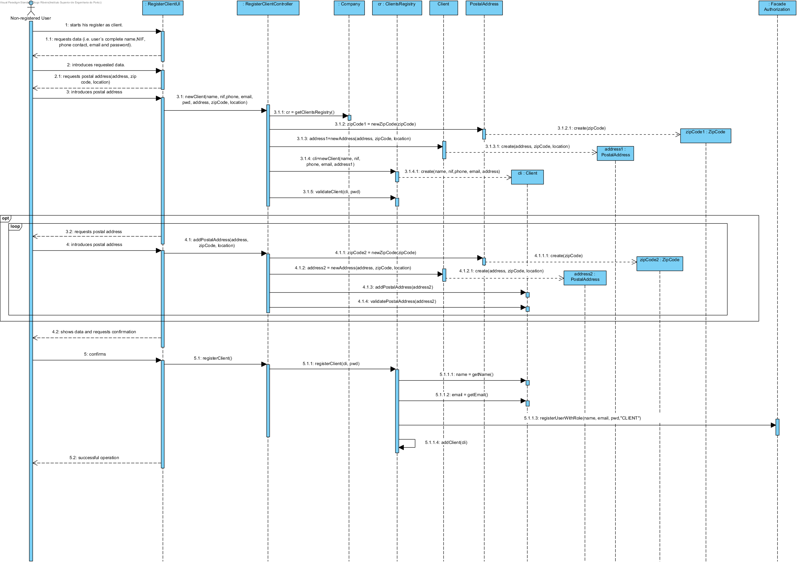
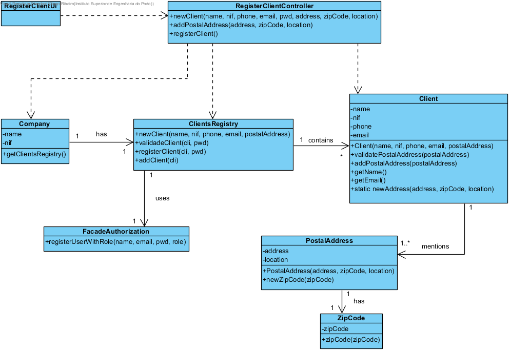

# UC1 Register as Client Realization

## Rational

| Main flow                                                                                        | Question: Which Class...                                      | Answer                                       | Justification                                                                                                         |
|:-------------------------------------------------------------------------------------------------------|:------------------------------------------------------------|:-----------------------------------------------|:---------------------------------------------------------------------------------------------------------------------|
|1. The non-registered user starts his register as client. |... interacts with the user?|RegisterClientUI|PureFabrication|
||...coordinates the UC?|RegisterClientController|Controller|
||...creates Client?|ClientsRegistry| HC + LC (on company) + Creator (Rule 1)|
||...knows the ClientsRegistry?|Company| HC + LC |
|2. The system requests the required data (i.e. user´s complete name,NIF, phone contact, email and password). | | | |
|3. The non-registered user introduces the requested data.| ... saves the introduced data?|Client|Information Expert (IE) - instance created in step 1|
|4. The system requests one postal address.||||
|5. The non-registered user introduces the postal address.|...creates PostalAddress?|Client|Creator (Rule 4)|
|| ... saves the introduced data?| PostalAddress|Information Expert (IE) - instance created in this step|
|||ZipCode| IE: one PostalAddress has one ZipCode|
|6. The system validates and saves the postal address that was introduced.|... saves the instance of PostalAddress created?| Client|Information Expert (IE) - At the MD the Client mentions one or more PostalAddress|
|7. Steps 4 to 6 are repeated until all the postal addresses are introduced (minimum 1).||||
|8. The system validates and shows the data to the non-registered user, asking to confirm them.|...validates the Client's data (local validation)?|Client|E: Client has his own data|
||...validates the Client's data (global validation)?|ClientsRegistry|IE: The ClientsRegistry contains Client|
|9. The non-registered confirms. ||||
|10. The system records the data of the client and registered user and informs the non-registered user of the success of the operation. |...saves the registered Client?|ClientsRegistry|IE. The ClientRegistry contains Services|
|| ... saves the user account of this client?  | FacadeAuthorization | IE. The User management is the responsibility of the respective external component whose point of interaction is through the class "AuthorizationFacade" |   
|| ... notifies the user?  | RegisterClientUI | |                                               

## Systematization ##

 From the rational results that the conceptual classes promoted to software classes are:

 * Company
 * PostalAddress
 * ZipCode
 * Client

Other software classes (i.e. Pure Fabrication) identified: 

 * RegisterClientUI  
 * RegisterClientController
 * ClientsRegistry

**Note:** The responsibility of creating instances of Postal Address was assigned to Client.
However, a client is only valid when he has at least one Postal Address.
In other words, to exist a Client it is necessary to have a Postal Address.
Thus, it is not feasible to ask a Client instance to create a Postal Address.
To resolve this issue the creation of instances of Postal Address is done through a static method in the Client class. Therefore, it is not necessary to have a client instance previously. Other approaches / alternatives are possible.

##	Sequence Diagram

##	Class Diagram

