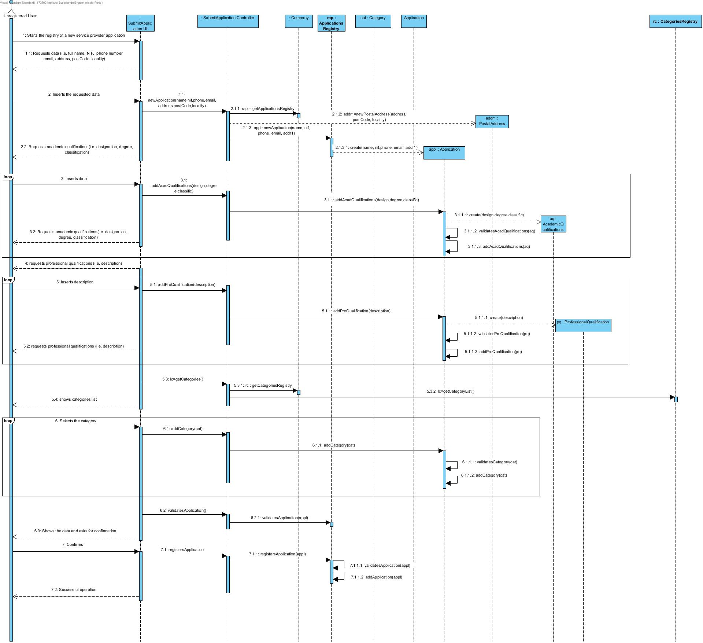
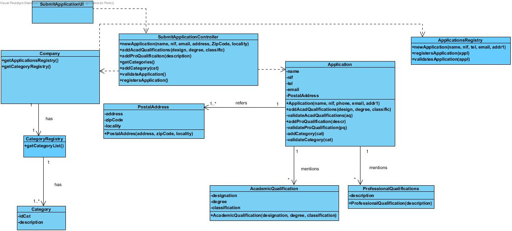

Realização de UC2 Submit Application as Service Provider
=============================================================

Racional
--------

| Main flow                                                                                                | Question: Which class...                                 | Answer                   | Justification                                                                                                         |
|------------------------------------------------------------------------------------------------------------------|------------------------------------------------------------|-------------------------------|------------------------------------------------------------------------------------------------------------------------|
| 1. The unregistered user starts the registry of a new service provider application.                                    | ...interacts with the user?                              | SubmitApplicationUI| PureFabrication, because it isn't justified to assign this responsability to any existent class in the domain model. |
|                                                                                                                  | ...coordinates the UC?                                          | SubmitApplicationController| Controller                                                                                                             |
|                                                                                                                  | ...Creates Application?                           | ApplicationRegistry| Creator (Rule 1)                                                                                                      |
| 2. The system requestes the necessary data (i.e. full name, NIF, phone number, email, address, zipCode and locality).   | n/a                                                        |                               |                                                                                                                        |
| 3. The unregistered user inserts the requested data                                                     | ... saves the data inserted?                          | Application| Information Expert (IE) - Instance created in step 1.                                                                |
|| ...Creates Address?                        | Application | Creator (Rule 4).                                                                                                     |
|                                                                                                                  | ... saves the data inserted?                         | Address| Information Expert (IE) - Instace created in this step.                                                                |
                                                                                                                   | | ...Creates PostalAddress?                        | Application | Creator (Rule 4).                                                                                                     |
|                                                                                                                  | ... saves the data inserted?                         | PostalAddress| Information Expert (IE) - Instace created in this step.                                                                |
|| ... saves the PostalAddress instance previously created?         | Application| Information Expert (IE) - In the domain model the application mentions one or more addresses.                                      | |
| 4. The system requests an academic qualification.                                                                |                                                            |                               |                                                                                                                        |
| 5. The unregistered user inserts the academic qualification.                                                 | ...Creates AcademicQualifications?                  | Application| Creator (Regra 1).                                                                                                     |
|                                                                                                                  | ... saves the data inserted?                           | AcademicQualifications| Information Expert (IE) - Instace created in this step.                                                                |
| 6. The system validates and saves the academic qualification.                                                           | ... saves the AcademicQualifications instance previously created?     | Application| Information Expert (IE) - In the domain model the application mentions one or more academic qualifications.                                        |
| 7. Repeat steps 8 to 10 while all the academic qualifications aren't inserted (minimum 1).               | n/a                                                        |                               |                                                                                                                        |
| 8. The system requests a professional qualification.                                                             |                                                            |                               |                                                                                                                        |
| 9. The unregistered user inserts the professional qualification.                                            | ...Creates ProfessionalQualifications?              | Application| Creator (Regra 1).                                                                                                     |
|                                                                                                                  | ... saves the data inserted?                        | ProfessionalQualifications| Information Expert (IE) - Instace created in this step.                                                                |
| 10. The system validates and saves the professional qualification.                                                    | ... saves the ProfessionalQualifications instance previously created? | Application| Information Expert (IE) - In the domain model the application mentions one or more professional qualifications.                                     |
| 11. Repeat steps 12 to 14 while all the professional qualifications aren't inserted (minimum 1).            | n/a                                                        |                               |                                                                                                                        ||
| 12. The system shows the available categories in the system.                                            | ...knows the existing categories?             | CategoriesRegistry | IE: CategoriesRegistry agregates all the categories.                                                                           |
| 13. The unregistered user selects the category of services he's able to perform.                       | | | 
|14. The system validates and saves the category.                                                                                                           | ...saves the selected category?                          | Application| Information Expert (IE) - In the domain model the application mentions one or more categories.                                         |
| 15. Repeat steps 20 to 22 while all the categories aren't inserted (minimum 1).                            |                                                            |                               |                                                                                                                        |
| 16.The system validates and presents the application to the unregistered user, asking for confirmation.  | ...validates the Application data? (local validation)       | Application| Information Expert (IE) - the application knows its own data.                                                        
|  | ...validates the Application data? (global validation)      | Company| Information Expert (IE) - the company aggregates Application.                                                        
| 17. The unregistered user confirms.                                                 |      |                       |                                                   |
| 18. The system registers the application and informs the unregistered user of the success of the operation.             | ...saves the application created?              | Company| Information Expert (IE) – In the domain model the company agregates Applications.                                            |
|                                                                                                                  | ...informs the unregistered user?                   | SubmitApplicationUI         |                                                                                                                        |

Systematization
--------------
From the rational, the resulting conceptual classed promoted to software classes are:

-   Company

-   Address

-   Application

-   AcademicQualifications

-   ProfessionalQualifications

Other software classes identified (i.e. Pure Fabrication)

-   ApplicationsRegistry

-   CategoriesRegistry

-   SubmitApplicationUI

-   SubmitApplicationController

Sequence Diagram
---------------------

Class Diagram
-------------------

