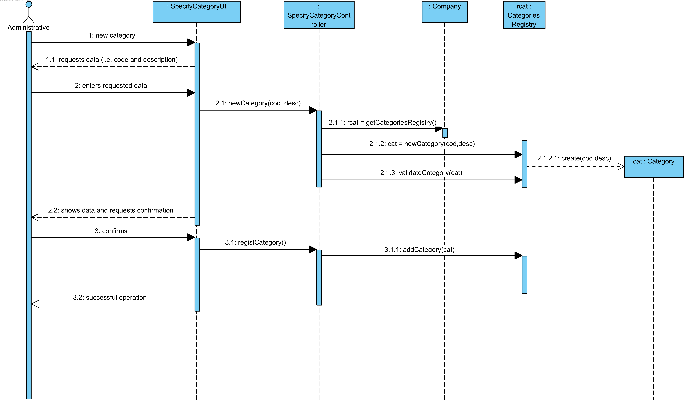
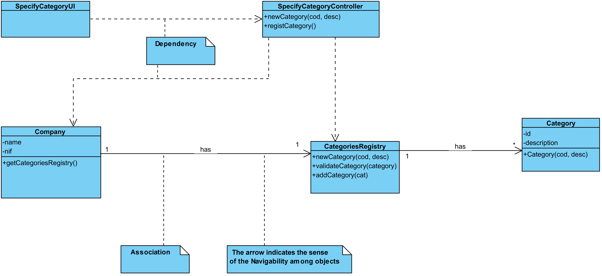

# UC3 Specify Category Realization

## Rational

| Main flow                                                                                        | Question: Which class...                                      | Answer                                       | Justification                                                                                                         |
|:-------------------------------------------------------------------------------------------------------|:------------------------------------------------------------|:-----------------------------------------------|:---------------------------------------------------------------------------------------------------------------------|
| 1. The administrative begins to specify a new category.  | …interacts with the user? | SpecifyCategoryUI| Pure Fabrication|
||…coordinates the UC?| SpecifyCategoryController                                | Controller.                                    |                                                                                                                      |
|| ... creates Category?          |CategoriesRegistry|HC + LC (on Company) + Creator (Rule 1)                           |                                                                                                                      |
| 2.The system requests the required data (i.e., unique code and description). |                  |                                                |                                                                                                                      |
| 3.The administrative enters the requested data.| ... saves the data?                    | Category | Information Expert (IE) - instance created in step 1                                                                    |
| 4. The system validates and presents the data to the administrative, asking you to confirm them. | ... validate category's data (local validation)? | Category                                     | IE: Category has its own data                                                                                              |
|| ... validade category's data (global validation)?                                           | CategoriesRegistry                                               | IE: CategoriesRegistry contains Categories |                                                                                                                      |
| 5. The administrative confirms.|                                                             |                                                |                                                                                                                      |
| 6.The system records the data and informs the management of the success of the operation.| ... saves the created Category?                          | Company                                 | IE. In modain model, Company contais Categories|
|| ... notifies the user?                                                                                | SpecifyCategoryUI                                        |                                                |                                                                                                                      |

## Systematization ##

From the rational results that the conceptual classes promoted to softwares classes are: 

 * Company
 * Category

Other software classes (i.e Pure Fabrication) identified:

 * SpecifyCategoryUI  
 * SpecifyCategoryController
 * CategoriesRegistry

##	Sequence Diagram

This approach considers that methods **"get"** and **"set"** must be avoided/minimized (cf. [here](https://www.javaworld.com/article/2073723/core-java/why-getter-and-setter-methods-are-evil.html)).

This approach implies the existence of a constructor with parameters in Category class. Thus, isnt required the use of this methods: **"set"**.
If **set** methods 
The "set" methods that exist will be privated.

This approach assumes although the objects:

* during of his/her creation are immediately valid (otherwise it would happen an excepção);
* only accept modifications to his current state that lead to another valid state.

By this way, it is not necessary to validate the object category locally created. However, the company continues to accomplish the global (e.g. they don't exist duplicated) validations.

##	Classes Diagram

