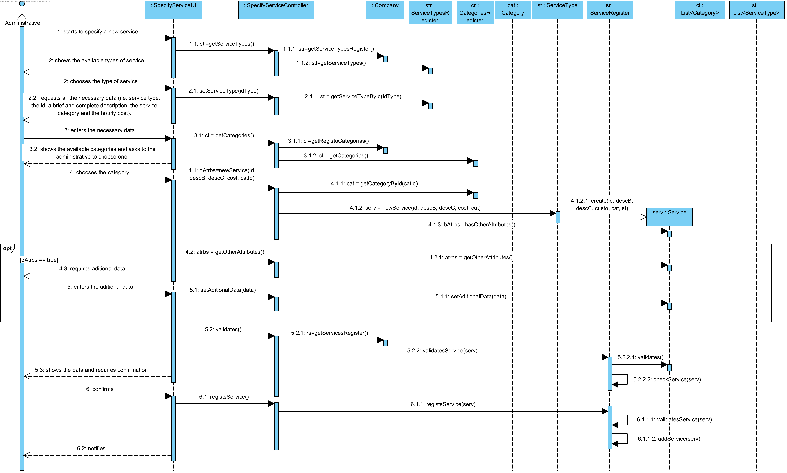

# UC4 Specify Service Realization

## Rational

| Main flow                                                                                        | Question: Which Class...                                      | Answer                                      | Justification                                                                                                         |
|:-------------------------------------------------------------------------------------------------------|:------------------------------------------------------------|:-----------------------------------------------|:---------------------------------------------------------------------------------------------------------------------|
| 1. The administrative starts to specify a new service.| ...interacts with the user?| SpecifyServiceUI| PureFabrication |
||...coordinates the UC?|SpecifyServiceController| Controller |
||...creates Servico?|ServiceType| Creator (Rule 1) and HC+LC - the creation of each service depends on their type of service. |
| 2. The system shows the available types of service and asks to the administrative to choose one.|...knows the supported service types?|ServiceTypesRegister|HC+LC |
| 3. The administrative chooses the type of service.| ...saves the choosen type of service?|Service|IE: service has a type - instance of Service created. |
| 4. The system requests all the necessary data (i.e. service type, the id, a brief and complete description, the service category and the hourly cost). | | | |
| 5. The administrative enters the necessary data. | ...saves the inserted data?| Service | Information Expert (IE) - instance previously created. |
| 6. The system shows the available categories and asks to the administrative to choose one.| ...knows the available categories| CategoriesRegister| HC+LC |
| 7. The administrative chooses the type of service.| ...saves the selected category?| Service| IE: Service has a category - instance previously created|
| 8. The system requires aditional data, if necessary. |...knows if it's necessary more data?|Service|IE.: instance previously created. |
| 9. The administrative enters the aditional data. |... saves the aditional data?|Service|IE.: instance previously created. |
| 10. The system validates the data and show them to the administrative, asking him to confirm them.| ...validates the Service data (local validation)?| Service| IE: Service has is own data. |
| | ...validates the Service data (global validation)?| ServicesRegister | HC+LC||
| 11. The administrative confirms. | | | |
| 12. The system records the data and notifies the administrative. | ...saves the created Service?| ServicesRegister | HC+LC |
|| ... notifies the user?   |SpecifyServiceUI                                        |                                                |                                                                                                                      

## Systematization ##

 From the rational results that the classes promoted to software classes are:

 * Company
 * ServiceType
 * Service
 * Category

Other indentified software classes (i.e. Pure Fabrication) are:  

 * SpecifyServiceUI
 * SpecifyServiceController
 * ServiceTypesRegister
 * ServicesRegister
 * CategoriesRegister

##	Sequence Diagram

##	Class Diagram

