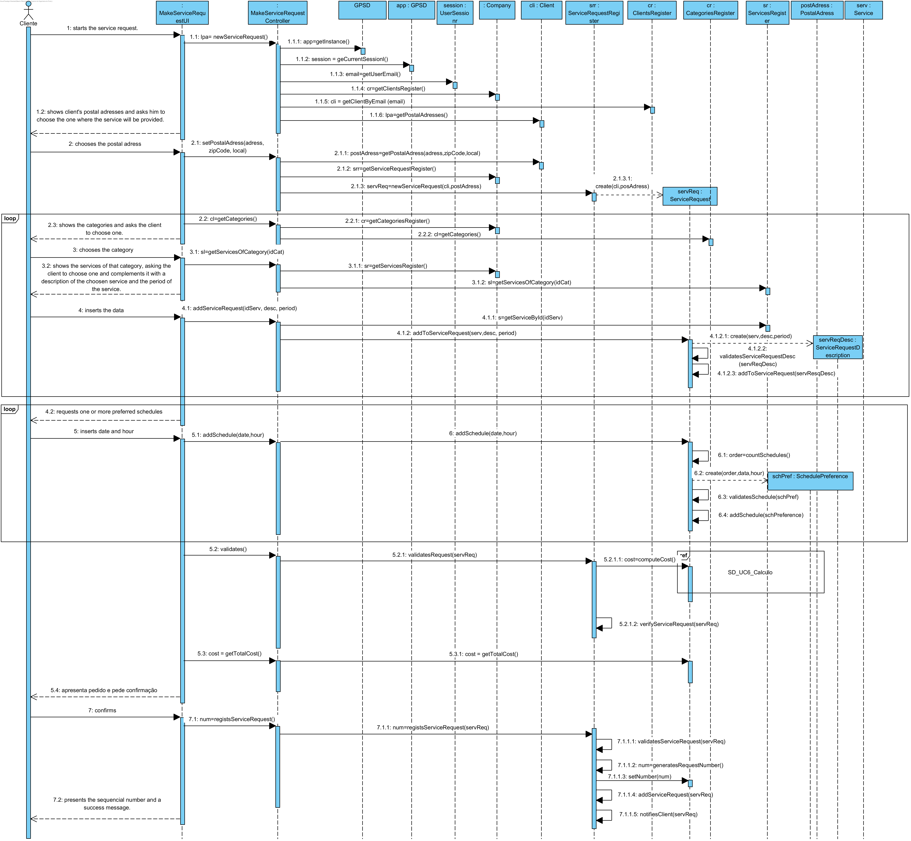
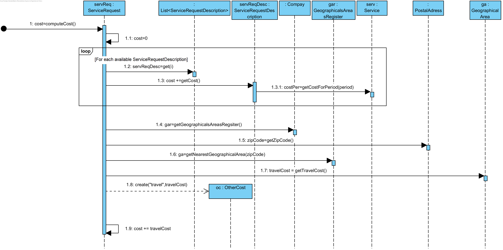
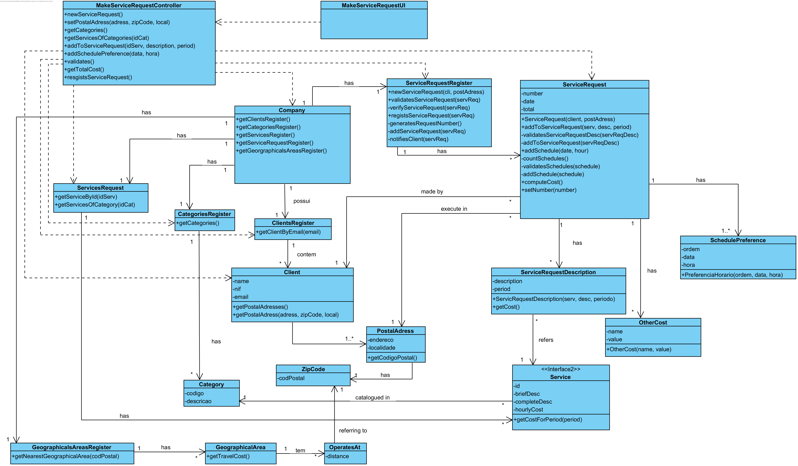

# UC6 Make a Service Request Realization

## Rational

| Main Flow                                                                                        | Question: Which Class...                                      | Answer                                      | Justification                                                                                                         |
|:-------------------------------------------------------------------------------------------------------|:------------------------------------------------------------|:-----------------------------------------------|:---------------------------------------------------------------------------------------------------------------------|
| 1.  The client starts the service request.  | ... interacts with the user? | MakeServiceRequestUI | Pure Fabrication |
|| ... cordenates the UC? | MakeServiceRequestController | Controller |
|| ... creates ServiceRequest? | RegistoPedidoPrestacaoServiços | Creator (Rule 1) and HC +LC |
| 2.The system shows client's postal adresses and asks him to choose the one where the service will be provided. | ...knows the client's postal adresses ? | Client | IE: Client has 1 or more Postal Adresses |
|3. The client chooses the postal adress. | ...saves the postal adress selected? | ServiceRequest|IE: Instance previsouly created. In MD ServiceRequest is provided in a specific Postal Adress. |
|4. The system shows the categories and asks the client to choose one.|...knows the available categories? | CategoriesRegister | IE: CategoriesRegister has Category|
|5. The client chooses the category. | | | |
|6. The system shows the services of that category, asking the client to choose one and complements it with a description of the choosen service, and if necessary inserts the period of the service. | ...knows the services of a category? | ServicesRegister | IE: ServicesRegister knos all the Services. |
|||Service|IE: In MD Service knows his category|
|7. The client chooses the service and inserts the description and period. | |||
|8. The system validates and saves the information. |...saves the inserted data?|ServiceRequestDescription|IE:In MD a Service Request has more than one Service with this data. |
||...cerates ServiceRequestDescription?|ServiceRequest|Creator (rule 1)|
||...validates the data?(local)| ServiceRequestDescription |IE: ServiceRequestDescription has his own data.|
||...validates the data?(global)| ServiceRequest |IE: ServiceRequest knows his descriptions.|
|9. The steps 4 to 8 repeat until all the services requested by the client are specified. ||||
|10. The system requests one or more preferred schedules (start hour and date). ||||
|11. The client inserts the schedules.||||
|12. The system validates and saves the schedule.|...validates and saves the schedule?|SchedulePreference|IE: these are the data of this class.|
||| ServiceRequest|IE: In MD ServiceRequest has one or more SchedulePreference. |
||...creates SchedulePreference?|ServiceRequest|Creator(Rule 1)|
|13. The steps 10 to 12 repeat until one schedule has been defined.
|14. The system validates the service request, computes the estimated cost and presents the result to the client, asking him to confirm. |... validates the request?(local validation)|ServiceRequest|IE: knows his own information.|
||...validates the request? (global validation)|ServiceRequestRegister|IE: ServiceRequestRegister knows all ServiceRequest|
||...computes the total cost?|ServiceRequest|IE: knows all the services requested and the postal adresse. |
||...saves the travel cost?|OutroCusto|IE: In MD a ServiceRequest has OtherCost |
||...creates OtherCost| ServiceRequest |Creator (Rule 1)|
|15. O client confirms the service request. | | | |
|16. The system records it and assigns it a sequencial number and present a success message. | ... generates the sequencial number? | ServiceRequestRegister |IE: knows all the ServiceRequest ever made.|
||...saves teh sequencial number?|ServiceRequest|IE: instance previously created.|
||...saves the ServiceRequest?| ServiceRequestRegister |IE: ServiceRequestRegister receives all the ServiceRequest|
||...notificies the generated number and the succcess message?| EfetuarPedidoPrestacaoServicosUI ||

## Systematization ##

 From the rational results that the classes promoted to software classes are:

 * Company
 * Client
 * Service
 * Category
 * ServiceRequest
 * ServiceRequestDescription
 * SchedulePreference
 * OtherCost

Other indentified software classes (i.e. Pure Fabrication) are:

 * MakeServiceRequestUI
 * MakeServiceRequestController
 * ClientsRegister
 * CategoriesRegister
 * ServicesRegister
 * ServiceRequestRegister
 * GeographicalsAreasRegister

##	Sequence Diagram

##	Class Diagram

