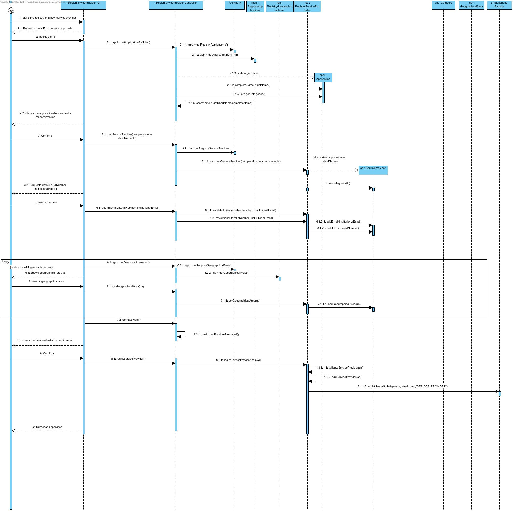
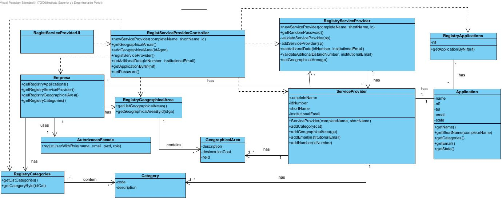

# Realization of the UC8 Register Service Provider

## Rational

| Main Flow                                            | Question: Which class...                           | Answer| Justification|
| :----------------------------------------------------------- | :------------------------------------------------ | :--------------------------------- | :----------------------------------------------------------- |
| 1. The HRO starts the registry of a new service provider.| RegistServiceProviderUI|PureFabrication|
|| ...coordenates the UC?                                 | RegistServiceProviderController | Controller                                                   |
||...creates ServiceProvider? | RegistryServiceProvider |Pattern HC + LC (regarding the Company) + Creator (Rule 1)
| 2. The system requests the NIF of the service provider. ||||
|3. The HRO inserts the NIF.|||
|4. if the application is valid, the system shows the collected data from the application (i.e. full name, short name and categories) and asks for confirmation. | ... knows all the applications?|RegistryApplications|IE: The RegistryApplications aggregate Applications|
||... knows the data of the application?              | Application| IE: it knows its own information.                     |
|5. The HRO confirms.                                          |                                                   |                                    |                                                              |
|6. The system requests more data (i.e. idNumber, institutionalEmail).  | |                                    |                                                              |
|7. The HRO inserts the data.                      | ... saves the inserted data?  |       ServiceProvider|Information Expert (IE) - Instance created in step 1|
|8. The system shows the geographical area list.  | ... knows all the geographical areas? | RegistryGeographicalAreas|IE: The RegistryGeographicalAreas aggregates geographicalAreas|
|9. The HRO selects the geographical area.             | ... saves the selected geographical area? |    ServiceProvider |Information Expert (IE) - Instance created in step 1|
|10. Repeat steps 8 to 9 while all the geographical areas aren't inserted (minimum 1).||||
|11. The system validates and shows the data, asking for confirmation. | ...validates the ServiceProvider's data?(local validation) | ServiceProvider|IE: it knows its own information.                                            |
|| ...validates the ServiceProvider's data?(global validation)? |RegistryServiceProviders | IE: The RegistryServiceProviders aggregates Service Providers |
|12. The HRO confirms.                                          |                                                   |                                    |                                                              |
|13. The system **regists the service provider's data** and informs the HRO of the success of the operation. | ...saves the ServiceProvider registered? | RegistryServiceProvider | IE: The RegistryServiceProvider aggregates Service Providers |
|                                                              | ... generate the necessary information?      |      RegistryServiceProvider |HC/LC: The company gives the responsability of this step to the class RegistryServiceProvider |
|                                                              | ... saves the required information? |  AutorizacaoFacade |IE. The management of users is a responsability of the external component "AutorizacaoFacade"|
|                                                              |                  ... notifies the user?                                 |         RegistryServiceProviderUI|                                                              |

## Systematization ##

From the rational, the resulting conceptual classed promoted to software classes are:

 * Company
 * Application
 * GeographicalArea
 * ServiceProvider

Other software classes identified (i.e. Pure Fabrication)

 * RegistServiceProviderUI
 * RegistServiceProviderController
 * RegistryServiceProvider
 * RegistryApplications
 * RegistryGeographicalAreas
 * Autorização/Facade

Sequence Diagram
---------------------

Class Diagram
-------------------

