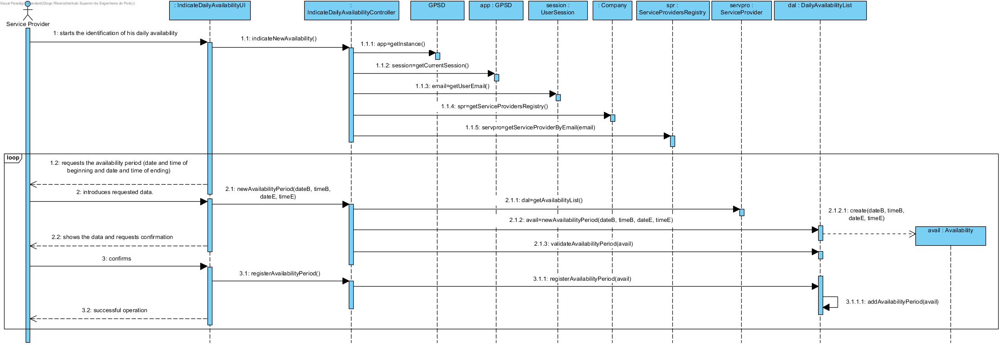
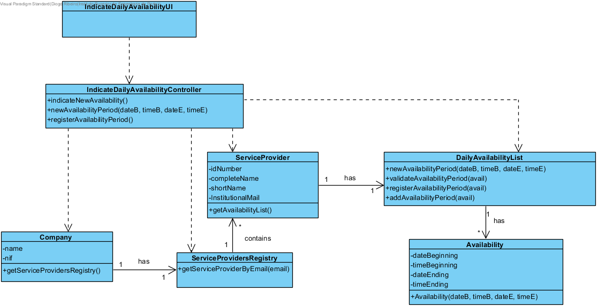

# UC9 Indicate Daily Availability Realization

## Rational

| Main Flow                                                                                        | Question: Which Class...                                      | Answer                                       | Justification                                                                                                         |
|:-------------------------------------------------------------------------------------------------------|:------------------------------------------------------------|:-----------------------------------------------|:---------------------------------------------------------------------------------------------------------------------|
|1. The service provider starts the identification of his daily availability.|... interacts with the user?|IndicateDailyAvailabilityUI|Pure Fabrication|
||...coordenates the UC?|IndicateDailyAvailabilityController|Controller|
||...creates Availability?|DailyAvailabilityList| HC + LC (on ServiceProvider) + Creator (rule 1)|
||...knows the DailyAvailabilityList?|ServiceProvider| HC + LC |
||...knows the ServiceProvider?|ServiceProvidersRegistry| HC + LC |
||...knows the ServiceProvidersRegistry?| Company| HC + LC |
|2. The system requests a period(date and time of beginning and date and time of ending) where the service provider is available to perform services.| | ||
|3. The service provider introduces the requested data.| ... saves the introduced data?|Availability| Information Expert (IE) - instance created in step 1|
|4. The system validates and shows the data to the service provider, asking to confirm them. |...validates the introduced data (local validation)?| Availability| IE: Availability has his own data|
| |...validates the introduced data (global validation)?|DailyAvailabilityList | IE: DailyAvailabilityList knows all of his Availability|
|5. The service provider confirms. | | ||
|6. The system records the availability of the service provider and informs the service provider of the success of the operation.|... saves Availability?| DailyAvailabilityList | IE: DailyAvailabilityList knows all of his Availability|
|7. Steps 2 to 6 are repeated until the service provider indicates all his availabilities.||||
                                        
## Systematization ##

 From the rational results that the conceptual classes promoted to software classes are:

 * Company
 * ServiceProvider
 * Availability

Other software classes (i.e. Pure Fabrication) identified:

 * IndicateDailyAvailabilityUI
 * IndicateDailyAvailabilityController
 * ServiceProvidersRegistry
 * DailyAvailabilityList

##	Sequence Diagram

##	Class Diagram

