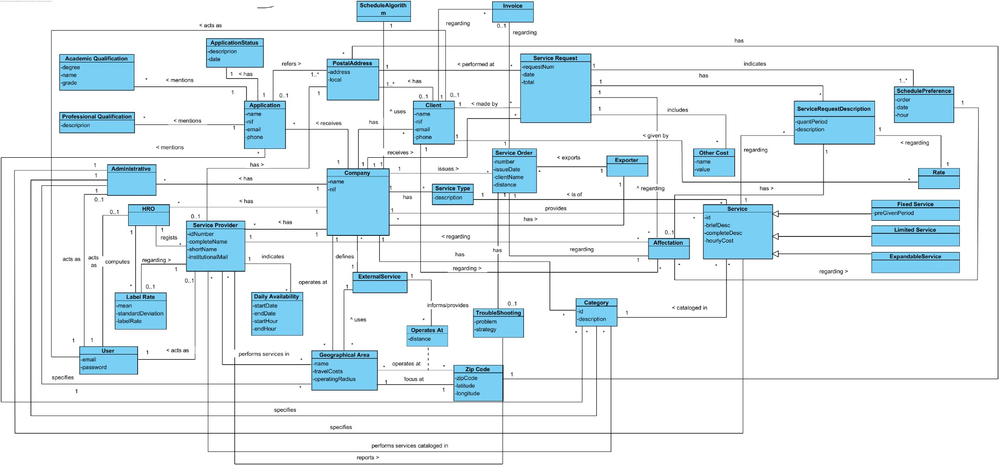

# OO Analysis #
The process of constructing of the domain model is based on the use cases, especially the nouns used, and on the description of the assignment.

## Rationale for the identification of the domain classes ##
For a classification of the domain classes, we use a list of functions of the TP classes (suggested in the book). As a result we have the following table of concepts (or classes, but not software) by category.

### _Categories List_ ###

**Transactions (of business)**

* Service Request
* Application
---

**Lines of transactions**

* Schedule Preference
* Service Request Description
* Other Cost
---

**Products or services related to transactions**

* Service
* Fixed Service
* Limited Service
* Expandable Service
---

**Records (of transactions)**

---  

**Peoples's roles**

* Administrative
* Human Resources Officer (HRO)
* Client
* Service Provider
* User
* Non-registered User

---

**Places**

* Geographical Area
*  Postal Address
*  Zip Code

---

**Events**

*

---

**Physical objects**

*

---

**Specifications and descriptions**

*  (Specify) Category (of Service)
*  (Specify) Service
*  Academic Qualification
*  Professional Qualification
*  Availability
*  Service Type
*  File Format

---

**Catalogs**

*  

---

**Sets**

*  

---

**Elements of Sets**

*  

---

**Organizations**

*  Company

---

**Other systems (external)**

* (User Management Component)
* External Service
* Scheduling Algorithm
* Exporter

---

**Records (financial), work, contracts, legal documents**

*

---

**Financial instruments**

*  

---

**Referred documents / to perform the tasks /**

---

###**Rationale on identifying associations between classes**###

An association is a relationship between instances of objects that indicates a relevant connection that is worth remembering, or is derivable from the List of Common Associations:

+ A is physically (or logically) part of B
+ A is physically (or logically) contained in B
+ A is a description of B
+ A is known / captured / recorded by B
+ A uses or generates B
+ A is related to a transaction of B + etc.

| Concept (A) 		|  Association  		|  Concept (B) |
|----------	   		|:-------------:		|------:       |
| Administrative | specifies | Category  |
|	| specifies | Service  |
| | specifies |  Geographical Area  |
| | works for | Company |
| | acts as | User |
| Company  | provides | Service  |
| | has | Category
| | defines | Geographical Area |
| | has | Client |
| | has | Administrative |
| | has | HRO |
| | has | Service Provider |
| | receives | Application |
| | receives | Service Request |
| | defines | External Service |
| | has (many) | Service Type |
| | issues | Service Order |
| | has | File Format |
| | defines | Schedule Algorithm |
| Service | cataloged in | Category |
| | is requested in | Service Request |
| | referred to in | Service Request Description |
| | is from (one) | Service Type |
| Fixed Service | is a specialization of | Service |
| Limited Service | is a specialization of | Service |
| Expandable Service | is a specialization of | Service |
| Client | has | PostalAddress |
| | acts as | User |
| | requests | Service Request |
| | referred to in | Invoice |
| | referred to in | Affectation |
| | gives | Rate |
| Category | catalogs | Service |
| | is mentioned in | Application |
| | is mentioned in | Service Provider |
| Service Provider | acts as | User |
| | indicates (many) | Availability |
| | performs services in (many) | Geographical Area |
| | performs services cataloged in (many) | Category |
| | has | PostalAddress |
| | referred to in | Affectation |
| HRO | acts as | User |
| | regists | Service Provider |
| | computes | Label Rate |
| Application | refers | PostalAddress |
| | mentions | Academic Qualifications |
| | mentions | Professional Qualifications |
| | mentions | Category |
| | has | Application Status |
| Service Request | made by | Client |
| | includes | Other Cost |
| | indicates | Schedule Preference |
| | has | Service Request Description |
| | performed at | PostalAddress |
| | referred to in | Invoice |
| | referred to in | Service Order |
| Service Request Description | is in | Service Request |
| | regarding | Service |
| | is in | Affectation |
| Geographical Area | focus at | Zip Code |
| | uses | External Service |
| | operates at | Zip Code |
| External Service | informs/provides | (Distance + Zip Code) (see note) |
| Postal Address | has (one) | Zip Code |
| File Format | has | Exporter |
| Export | exports | Service Order |
| Affectation | referred to in | Service Order |
| | regarding | Schedule Preference |
| | regarding | Service Provider |
| | has | Service Request Description |
| Rate | given by | Client |
| | regarding | Service Request Description |
| Label Rate | regardind | Service Provider |
| Schedule Algorithm | creates | Affectation |

## Domain Model

