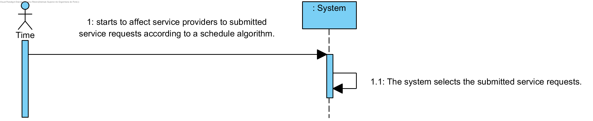

# UC10 - Affect Service Providers

## Brief Format

The Timer starts to affect service providers to submitted service requests. The system select the service request according to schedule algorithms (First-Come First-Served or Random) and select the service provider using different algorithms that will follow specific restrictions (categories executed by the service providers and client and service providers's avalibility).

## SSD

## Fully-dressed Format

### Primary actor
Timer

## Stakeholders and Interests
* Company: intends to have well affected service providers.
* Client: intends to have a service provider to execute the service.
* Service Provider: intends to have a service to provide.

### Preconditions
The system must have registered service providers and service requests

### Postconditions
The information of the service is recorded in the system.

## Main success scenario (or basic flow)

1. Timer starts to affect service providers to submitted service requests according to a schedule algorithm.
2. The system selects the submitted service requests.

### Extensions (or alternative flows)

3a. There aren't any affectations. Situation handled by the administrative.

### Special Requirements
\-

### Technology and Data Variations List
\-

### Frequency of Occurrence
\-
### Miscellaneous

* Are there more schedule algortithms available?
