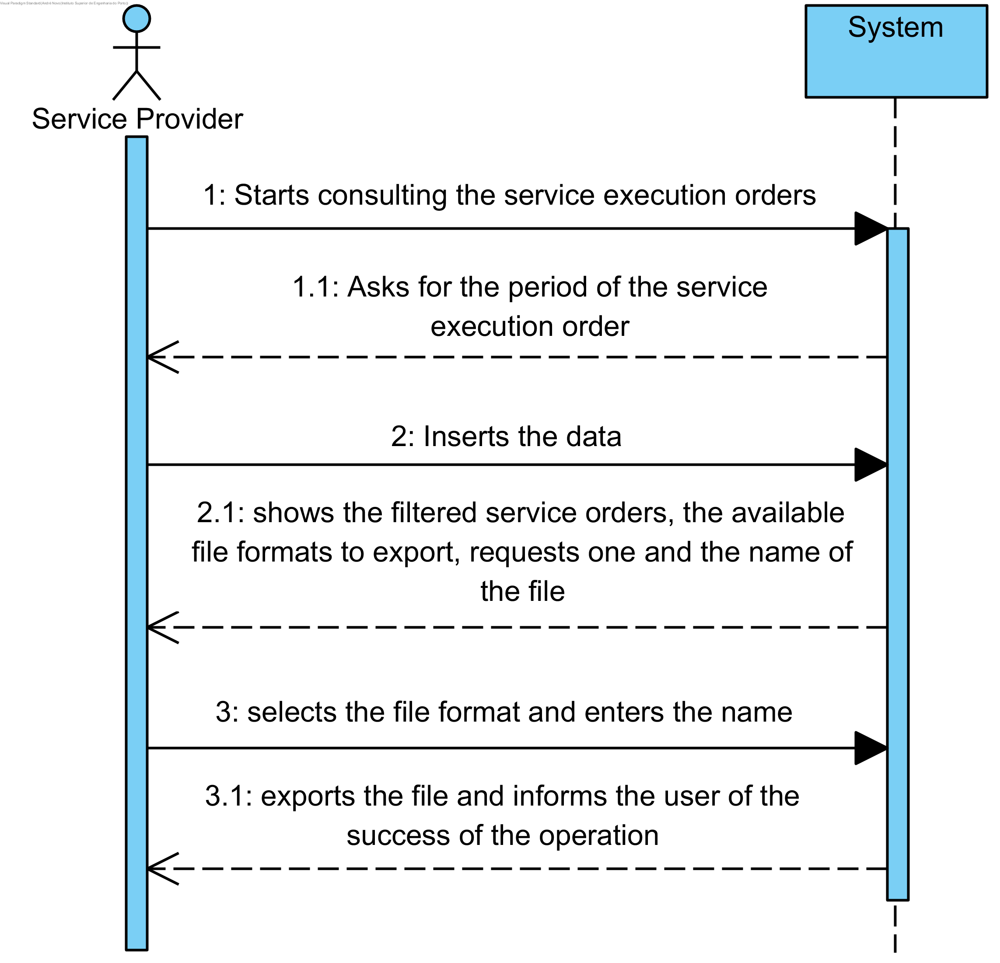

# UC12 - Consult service orders

## Brief Format

The services provider starts to consult the service orders. The system requests the service order period. The service provider enters the requested data. The system shows available file formats to export, requests one and the name of the file. The service provider selects the desired file format and enters the name. The system exports the file and informs the service provider of the success of the operation.

## SSD

## Complete Format

### Primary Actor

Service Provider

### Stakeholders and interests
* **Service Provider:** pretends to check his service orders.

### Preconditions
n/a

### Success Guarantee
n/a

## Main Success scenario

1. The services provider starts to consult the service orders.
2. The system requests the service order period.
3. The service provider enters the requested data.
4. The system shows available file formats to export, requests one and the name of the file.
5. The service provider selects the desired file format and enters the name.
6. The system exports the file and informs the service provider of the success of the operation.

### Extensions

*a. The service provider requests the cancellation of the query of service orders.

> The use case ends.

4a. There are no service orders for the indicated period.
> 1. The system informs the service provider on which data is missing.
> 2. The system allows the service provider to enter the missing data (step 3)
> > 2a. The administrative doesnt change the data. The use case ends.

5a. The service provider doesn't want to export the file.
> 1. The use case ends.

### Special Requirements
\-

### Technology and Data Variations List
\-

### Frequency of Occurrence
\-

### Miscellaneous

* What's the frequency of occurrence of this use case?