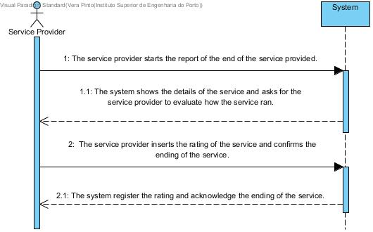

# UC13 - Report the end of the service provided

## Brief Format
The service provider starts the report of the end of the service provided. The system shows the details of the service and asks for the service provider to evaluate how the service ran. The service provider inserts the rating of the service and confirms the ending of the service. The system register the rating and acknowledge the ending of the service.

## SSD

## Complete Format

### Primary Actor

Service Provider

### The stakeholders and their interests

* ** Service Provider: ** wants to confirm the ending of the service and evaluate how the service ran.
* ** Company: ** wants to know how the service was and if were there any problems.

### Pre-conditions
n/a

### Pos-conditions
n/a

## Main Sucess Scenario ()
1. The service provider starts the report of the end of the service provided.
2. The system shows the details of the service and asks for the service provider to evaluate how the service ran.
3. The service provider inserts the rating of the service and confirms the ending of the service.
4. The system register the rating and acknowledge the ending of the service.

### Extensions (or alternative flows)
a. The service provider cancels the ...
> The use case ends.

3a. The service provider detects a problem with the execution of the service.
>        1. The system asks the service provider to introduce a description reporting the issue and troubleshooting strategy.
>        2. The system register the description of the issue and the respective the troubleshooting strategy.

### Special Requirements
\-

### Techonology and Data Variations List
\-

### Frequency of occurence
\-

### Open Questions
n/a
