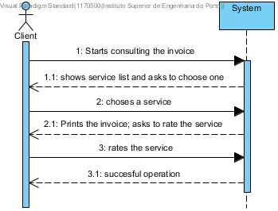

# UC8 - Rating a Service

## Brief format

The client starts consulting the invoice. The system shows the service list and asks to choose one of them. The client chooses a service. The system shows the invoice and asks the client to rate the service (0-5). The client rates the service. The system registers the rating and informs the client of the success of the operation.

## SSD

## Complete format

### Primary actor

Client

### Stakeholders and interests
* **Client:** pretends to rate the service to award or condemn a service provided.
* **Service provider:** pretends to be rated in order to gain a certain reputation.

### Preconditions
* The service execution must be complete.

### Success Guarantee
* The rating data is saved on the system.

## Main Success Scenario

1. The Client starts consulting the invoice.
2. The System shows the service list and asks to choose one.
3. The Client chooses a service.
4. The System shows the invoice and asks the client to rate the service.
5. The Client rates the service. 
6. The system registers the rating and informs the client of the success of the operation.

### Extensions

*a. The Client cancels the rating.

> The use case-ends.

2a. The system doesn't have services to show. 

>	1.  The system informs the user.

> 	>	The use-case ends.

3a. The system detects that service data inserted is invalid.

>	1.  The system informs the Client.

>	2.  The system allows the user to change (step 3).

>	>   2a. The Client doesn't modify the data. The use-case ends.

### Special Requirements
\-

### Technology and data variations list
\-

### Frequency of Occurrence
\-

### Miscellaneous

