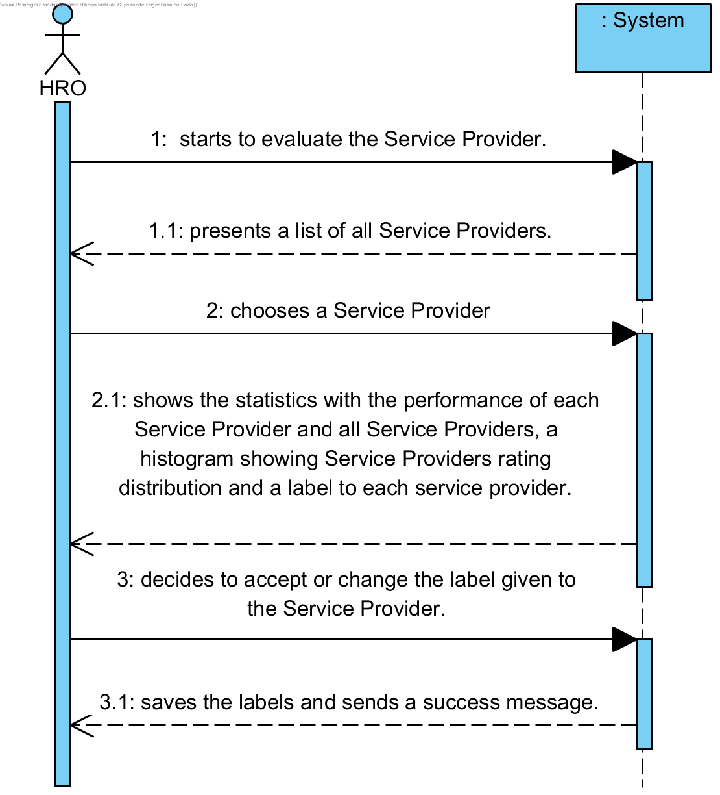

# UC15 - Evaluate Service Provider

## Brief Format

The HRO starts to evaluate the Service Provider. The system shows the Service providers and ask HRO to choose one. HRO chooses a Service Provider. The system shows statistics with the performance of each Service Provider, a label rate and a histogram showing Service Provider rating distribution. The HRO decides to accept or change the label given to the Service Provider. The system saves the labels and sends a success message.

## SSD

## Fully-dressed Format

### Primary actor

HRO

### Stakeholders and Interests

* HRO: intends to evaluate Service Providers.
* Service Provider: intends to be evaluated.
* Company: intends to have reliable evaluations of Service Providers.

### Preconditions
The system must have rated Service Providers

### Postconditions
The information of the service is recorded in the system.

## Main success scenario (or basic flow)

1. The HRO starts to evaluate the Service Provider.
2. The system presents a list of all Service Providers.
3. The HRO chooses a Service Provider
4. The system shows the statistics with the performance of each Service Provider and all Service Providers, a histogram showing Service Providers rating distribution and a label to each service provider.
5. The HRO decides to accept or change the label given to the Service Provider.
6. The system saves the labels and sends a success message.

### Extensions (or alternative flows)

*a. The HRO wants to cancel the Service Provider evaluation.
> The use case ends.

5a. The HRO decides to change the label that has been given to the Service Provider.
> 1a. The system allows him to change.           
> 2a. The HRO changes the label.

### Special Requirements
\-

### Technology and Data Variations List
\-

### Frequency of Occurrence
\-

### Miscellaneous

* If the label rate changes, will the statistics be changed too?
