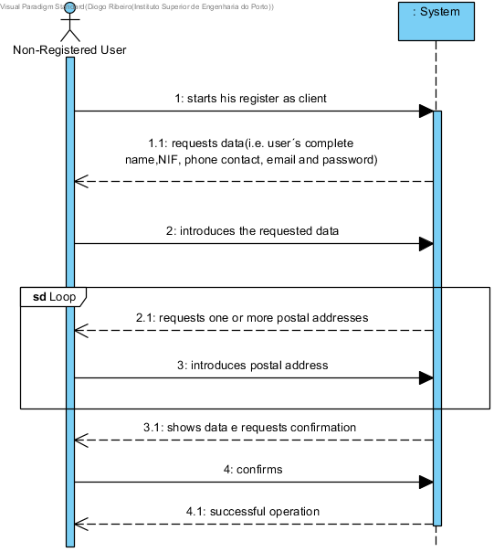

# UC1 - Register as Client

## Brief Format

The non-registered user starts his register as client. The system requests the required data (i.e. user´s complete name,NIF, phone contact, email, password and, at least, one postal address). The non-registered user introduces the requested data. The system validates and shows the data to the non-registered user, asking to confirm them. The non-registered confirms. The system records the data of the client and registered user and informs the non-registered user of the success of the operation.

## SSD

## Fully-dressed Format

### Primary actor

Non-registered user

### Stakeholders and interests
* **Non-registered user:** wants to register as a clint so he can enjoy the services provided by the company.
* **Company:** wants that the person in cause becomes a client in order to request services.

### Preconditions
n/a

### Success Guarantee
The information of the client is recorded in the system.

## Main Success Scenario (or main flow)

1. The non-registered user starts his register as client. 
2. The system requests the required data (i.e. user´s complete name,NIF, phone contact, email and password). 
3. The non-registered user introduces the requested data.
4. The system requests one postal address.
5. The non-registered user introduces the postal address.
6. The system validates and saves the postal address that was introduced.
7. Steps 4 to 6 are repeated until all the postal addresses are introduced (minimum 1).
8. The system validates and shows the data to the non-registered user, asking to confirm them.
9. The non-registered confirms. 
10. The system records the data of the client and registered user and informs the non-registered user of the success of the operation.

### Extensions (or alternative flows)

*a. The non-registered user requests the cancellation of the register as a client.

> The use case ends.

4a. NIF and/or email duplicated.
>	1. The system informs the user about the data duplication.
>	2. The system allows the introduction of new data (step 3)
>
	>	2a. The non-registered user doesn't change the data. The use case ends.

6b. Data related to the postal address incomplete.
>	1. The system informs on which data is missing.
>	2. The system allows the introduction of the missing data (step 5)
>
	>	2a. The non-registered user doesn't change the data. The use case ends.

8a. Required minimum data missing.
>	1. The system informs on which data is missing.
>	2. The system allows the introduction of the missing data (step 3)
>
	>	2a. The non-registered user doesn't change the data. The use case ends.

8b. The system detects that the data (or some subset of the data) entered must be unique and already exist in the system.
>	1. The system alerts the non-registered user to the fact.
>	2. The system allows the non-registered user to change it (step 3).
>
	>	2a. The non-registered user doesn't change the data. The use case ends.

8c. The system detects that the entered data (or some subset of the data) is invalid.
> 1. The system alerts the non-registered user to the fact.
> 2. The system allows the non-registered user to change it (step 3).
> 
	> 2a. The non-registered user doesn't change the data. The use case ends.	

### Special Requirements
\-

### Technology and Data Variations List
\-

### Frequency of Occurrence
\-

### Miscellaneous

* Are there other mandatory data besides those already known?
* Is it necessary to have an additional security mechanism to confirm that the client is in fact who he claims to be?
* What are the security rules applied to the password?
* What is the frequency of occurence of this use case?