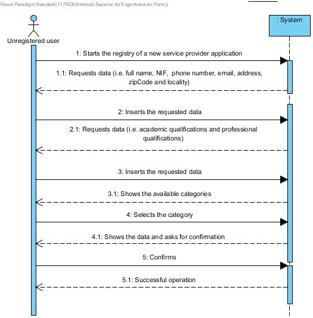

UC2 - Submit an application as service provider
=================================================

Brief Format
-------------
	
Starts the registration of a new service provider application. The system requests data (i.e. full name, NIF, phone number, email, addresses, academic qualifications and professional qualifications). The unregistered user inserts the requested data. The system shows the available categories and asks for the selection of those that the service provider will provide. The unregistered user selects the categories. The system validates the data and shows it to the user. The unregistered user confirms the application. The system registers a new application and informs the user of the success of the operation.

### SSD

Complete format
----------------

### Primary Actor

Unregistered user

### Stakeholders and interests

**Unregistered user:**  By doing a service provider application, he pretends to do services for the company.

**Company:** pretends that anyone who desires to collaborate with the company, presents their application as service providers.

### Preconditions

n/a

### Success guarantee

The application is registered in the system.

### Main success scenario (or basic flow)

1. The unregistered user starts the registry of a new service provider application.

2. The system requestes the necessary data (i.e. full name, NIF, phone number, email, address, zipCode and locality).

3. The unregistered user inserts the requested data

4. The system requests an academic qualification.

5. The unregistered user inserts the academic qualification.

6. The system validates and saves the academic qualification.

7. Repeat steps 8 to 10 while all the academic qualifications aren't inserted (minimum 1).

8. The system requests a professional qualification.

9. The unregistered user inserts the professional qualification.

10. The system validates and saves the professional qualification.

11. Repeat steps 12 to 14 while all the professional qualifications aren't inserted (minimum 1).              

12. The system shows the available categories in the system. 

13. The unregistered user selects the category of services he's able to perform.

14. The system validates and saves the category.

15. Repeat steps 20 to 22 while all the categories aren't inserted (minimum 1).  

16. The system validates and presents the application to the unregistered user, asking for confirmation. 

17. The unregistered user confirms.

18. The system registers the application and informs the unregistered user of the success of the operation. 

### Extensions (or alternative flows)

\*a. The unregistered user requests the cancellation of the application.

>	The use case-ends.

3a. Initial data is incomplete.

>	1.  The system informs the missing data.

>	2.  The system allows the introduction of the missing data (step 5).

>	>   2a. The unregistered user doesn't modify the data. The use-case ends.

6a. Academic qualification data is incomplete.

>	1.  The system informs the missing data.

>	2.  The system allows the introduction of the missing data (step 9).

>	>   2a. The unregistered user doesn't modify the data. The use-case ends.

10a. Professional qualification data is incomplete.

>	1.  The system informs the missing data.

>	2.  The system allows the introduction of the missing data (step 13).

>	>   2a. The unregistered user doesn't modify the data. The use-case ends.

12a. The system doesn't have categories of services to show. 

>	1.  The system informs the user.

> 	>	The use-case goes to step 24.

16a. Minimum required data missing

>	1.  The system informs the user of the data missing.

>	2.  The system allows the introduction of the missing data (step 3).

>	>   2a. The unregistered user doesn't modify the data. The use-case ends.

16b. The system detects that the data inserted must be unique and it already exists in the system.

>	1.  The system informs the user.

>	2.  The system allows the user to change (step 3).

>	>   2a. The unregistered user doesn't modify the data. The use-case ends.
 
16c. The system detects that the data inserted is invalid.

>	1.  The system informs the user.

>	2.  The system allows the user to change (step 3).

>	>   2a. The unregistered user doesn't modify the data. The use-case ends.

### Special requirements

n/a

### Technology and data variations list

n/a

### Frequency of occurrence

n/a

### Miscellaneous
