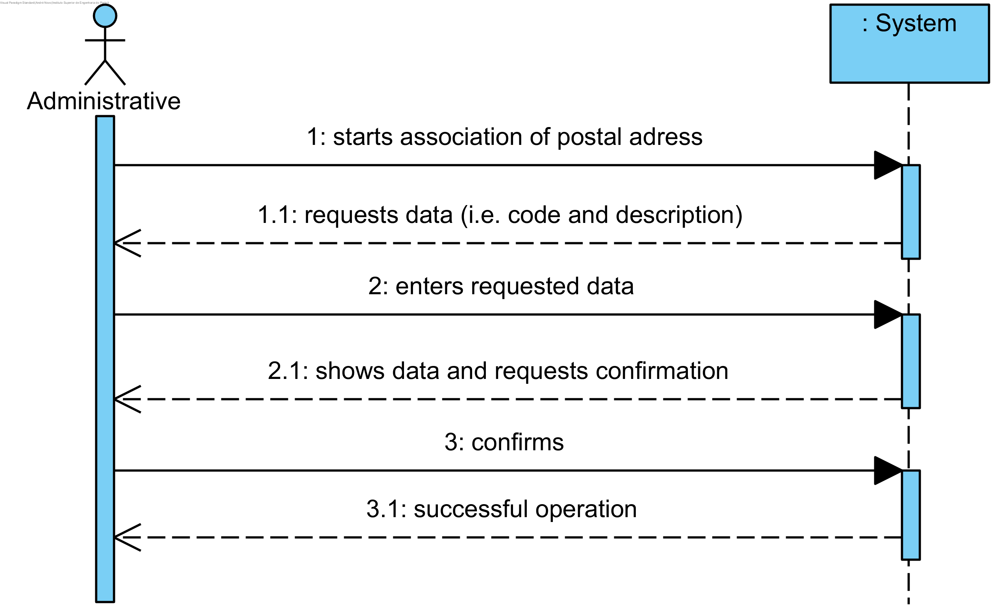

# UC3 - Specify Category (of Service)

## Brief Format

The administrative starts to specify a new category. The system requests the required data (i.e. unique code and description). The administrative enters the requested data. The system validates and presents the data to the administrative, asking you to confirm them. The administrative confirms. The system records the data and informs the management of the success of the operation.

## SSD

## Full-dressed Format

### Primary Actor

Administrative

### Stakeholders and their interests
* **Administrative:** intends to specify the categories of services so that it can later catalog the various services provided.
* **Client:** the cataloging of services into categories facilitates the performance of their actions.
* **Company:** wants to catalog your services.

### Preconditions
n/a

### Success Guarantee
Category information is recorded in the system.

## Primary success scenario (or base flow)

1. The administrative begins to specify a new category.
2. The system requests the required data (i.e. unique code and description).
3. The administrative enters the requested data.
4. The system validates and presents the data to the administrative, asking you to confirm them. 
5. The administrative confirms.
6. The system records the data and informs the management of the success of the operation.

### Extensions

*a. The administrative requests the cancellation of the category specification.

> The use case ends.

4a. Required minimum data missing.
>	1. The system informs the user on which data is missing.
>	2. The system allows the administrative to enter the missing data (step 3)
>
	>	2a. The administrative doesn't change the data. The use case ends.

4b. The system detects that the data (or some subset of the data) entered must be unique and already exist in the system.
>	1. The system alerts the administrative to the fact.
>	2. The system allows the administrative to change it (step 3).
>
	>	2a. The administrative doesn't change the data. The use case ends.

4c. The system detects that the entered data (or some subset of the data) is invalid.
> 1. The system alerts the administrative to the fact.
> 2. The system allows the administrative to change it (step 3).
> 
	> 2a. The administrative doesn't change the data. The use case ends.

### Special Requirements
\-

### Technology and Data Variations List
\-

### Frequency of occurrence
\-

### Open questions

* How often does this use case occur?