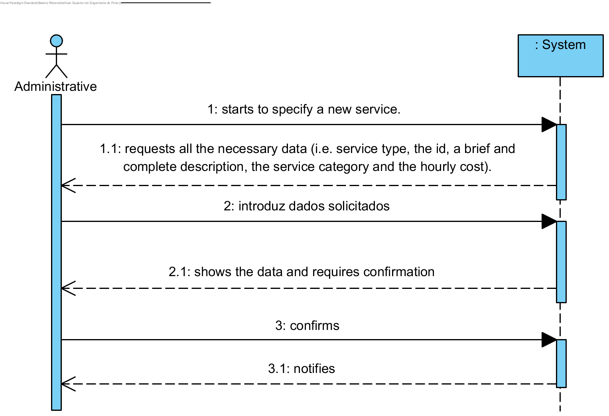

# UC4 - Specify Service

## Brief Format

The administrative starts to specify a new service. The system requests all the necessary data (i.e. service type, the id, a brief and complete description, the service category and the hourly cost). The administrative enters the necessary data. The system validates the data and show them to the administrative, asking him to confirm them. The administrative confirms. The system records the data and notifies the administrative.

## SSD

## Fully-dressed Format

### Primary actor

Administrative

### Stakeholders and Interests
* Administrative: intends to specify the services which will be requested for the clients.
* Client: intends to know which services are available for the request.
* Company: intends to provide well cataloged services.

### Preconditions
n/a

### Postconditions
The information of the service is recorded in the system.

## Main success scenario (or basic flow)

1. The administrative starts to specify a new service.
2. The system shows the available types of service and asks to the administrative to choose one.
3. The administrative chooses the type of service.
4. The system requests all the necessary data (i.e. service type, the id, a brief and complete description, the service category and the hourly cost).
5. The administrative enters the necessary data.
6. The system shows the available categories and asks to the administrative to choose one.
7. The administrative chooses the type of service.
8. The system requires aditional data, if necessary.
9. The administrative enters the aditional data.
10. The system validates the data and show them to the administrative, asking him to confirm them.
11. The administrative confirms.
12. The system records the data and notifies the administrative.

### Extensions (or alternative flows)

*a. The administrative wants to cancel the service specification.

> The use case ends.

2a. There aren't any types of service defined in the system.
> 1. The system warns the administritive for that. The use case ends.

6a. There aren't any categories defined in the system.
>   1. The system warns the administritive for that.
>   2. The system allows the creation of a new category (UC3).
> > 2a. O administrativo não cria uma categoria. O caso de uso termina.

8a. It isn't necessary to enter more data.
> 1. The system proceed to step 10.

10a. Minimum required data missing.
>	1. The system warns the administrative which data is missing.
>	2. The system allows the administrative to change the missing data (step 3).
>	>	2a. The administrative doesn't change tha data. The use case ends.

10b. The system identifies that data (or any subset of data) must be unique and already exists in the system.
>	1. The system warns the administrative for that.
>	2. The system allows the administrative to change the missing data (step 3).
>	>	2a. The administrative doesn't change tha data. The use case ends.

10c. The system identifies that inserted data (or any subset of data) is invalid.
>	1. The system warns the administrative for that.
>	2. The system allows the administrative to change the missing data (step 3).
>	>	2a. The administrative doesn't change tha data. The use case ends.

### Special Requirements
\-

### Technology and Data Variations List
\-

### Frequency of Occurrence
\-

### Miscellaneous

* Is every data essential for the specification of a service?
* Is it possible to specify a service without a category?
* Is it possible for a service to have more that on category?
* Which data allows ths system to identifie doubled services?
* Is the service id inserted by the administritive or generated by the system?
* What is the difference between complete and brief description?
* Is it necessary to save any history of service costs?
* What is the frequency of occurence of this use case?
