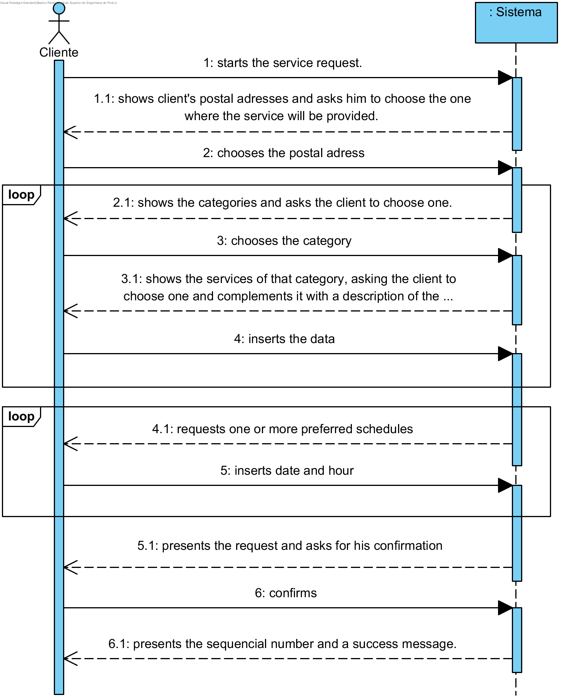

# UC6 - Efetuar Pedido de Prestação de Serviços

## Brief Format

The client starts the service request. The system shows client's postal adresses and asks him to choose the one where the service will be provided. The client chooses the postal adress. The system shows the categories and asks the client to choose one. The client chooses one and the system shows the services of that category, asking him to choose one. The client chooses one, complements the service request with a description of the choosen service, and if necessary inserts the period of the service. The selection of categories and services previously described repeats until all the services requested by the client are specified. Afterwards, the system requests one or more preferred schedules (start hour and date). The client inserts the schedules. The system validates the service request, computes the estimated cost and presents the result to the client, asking him to confirm. The client confirms the service request. The system records it and assigns it a sequencial number and present a success message.

## SSD

## Fully-dressed Format

### Primary actor

Client

### Stakeholders and Interests
* **Cliente:** pretende registar o pedido para que possa usufruir dos serviços prestados pela empresa.
* **Empresa:** pretende que os clientes possam solicitar serviços.

### Preconditions
- Existir pelo menos um serviço definido no sistema.

### Postconditions
A informação do pedido é guardada no sistema.

## Main success scenario (or basic flow)

1. The client starts the service request.
2. The system shows client's postal adresses and asks him to choose the one where the service will be provided.
3. The client chooses the postal adress.
4. The system shows the categories and asks the client to choose one.
5. The client chooses the category.
6. The system shows the services of that category, asking the client to choose one and complements it with a description of the choosen service, and if necessary inserts the period of the service.
7. The client chooses the service and inserts the description and period.
8. The system validates and saves the information.
9. The steps 4 to 8 repeat until all the services requested by the client are specified.
10. The system requests one or more preferred schedules (start hour and date).
11. The client inserts the schedules.
12. The system validates and saves the schedule.
13. The steps 10 to 12 repeat until one schedule has been defined.
14. The system validates the service request, computes the estimated cost and presents the result to the client, asking him to confirm.
15. O client confirms the service request.
16. The system records it and assigns it a sequencial number and present a success message.

### Extensões (ou fluxos alternativos)

*a. The client wants to cancel the service request.

> The use case ends.

2a. The system detects that client has only one postal adress.
>	1. The system accepts the postal adress and warns the client for that.
>	2. The system proceed to step 4.

3a. The client informs that wants to use a new postal adress.
>	1. The system allows him to associate another postal adresse to his information (UC7).
>	2. The system goes back to step 2.

6a. There aren't services for the choosen category.
> 1. The system warns the client for that.
> 2. The system allows tha client to choose another category (step 5).

8a. Minimum required data missing.
>	1. The system warns the client which data is missing.
>	2. The system allows the client to change the missing data (step 7).
>	>	2a. The client doesn't change tha data. The use case ends.

12a. Minimum required data missing.
>	1. The system warns the client which data is missing.
>	2. The system allows the client to change the missing data (step 10).
>	>	2a. The client doesn't change tha data. The use case ends.

14a.The system identifies that inserted data (or any subset of data) is invalid.
>	1. The system warns the administrative for that.
>	2. The system allows the administrative to change the missing data (step 3).
>	>	2a. The administrative doesn't change tha data. The use case ends.

### Special Requirements
- Th minimum period allowed is 30 min, and it's only possible to insert multiples of this value.
- Not all of the services requiere a period.

### Technology and Data Variations List
\-

### Frequency of Occurrence
\-

### Miscellaneous

* ~~Is it possible for the client make a service request without selecting a category?~~
* ~~Is the service description mandatory?~~
* What is the maximum number of schedules?
* ~~According to services that require a period, is this the maximum or minimum amount of time? Is it mandatory?~~
* ~~The amount of time is a value in hours. Is it an integer or recognises decimal part?~~
* Does the system must take an infinity capacity for the execution of services?
* How does the system validates the service request?
* Can a service be accepted if it hasn't any service provider that doesn't provide it?
* ~~Is there any availability schedules for the service providers?~~
* The sequencial number of the service request (generated by the system) will be only shown to the client or we must expect the sending of an email of confirmation?
* Knowing the estimated cost, should we allow the client to specify a maximum value for service request?
