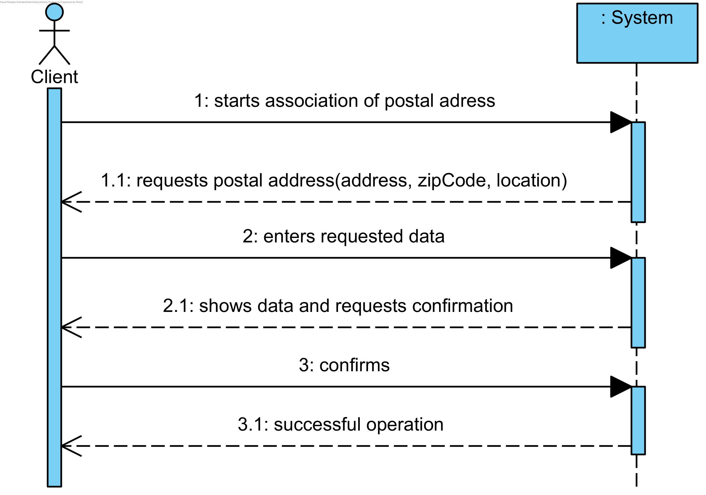

UC7 – Associate Postal Address with Client
==============================

Brief Format
-------------

The client initiates the association of a new postal address with their information. The system requests the required (postal address) data. The client introduces the requested data. The system validates and presents the data, asking that confirms them. Client confirms. The system associates the postal address to the client and informs him of the success of the operation.

SSD
---

Full-dressed Format
----------------

### Primary Actor

Client

### Stakeholders and Interests

-   **Client:** intends to associate a new address to his/her list of addresses.

-   **Company:** intends the client to request services for any one of their addresses.

### Preconditions

(Client must be authenticated in the system)

### Success Guarantee

The client's adress is saved in the system.

Main Success Scenario
----------------------------------------------

1.  The client initiates the association of a new postal address with their information.
2.  The system requests the required (postal address) data. 
3.   The client introduces the requested data. 
4.  The system validates and presents the data, asking that confirms them.
5.  The client confirms.
6.   The system associates the postal address to the customer and it informs him of the success of the operation.
    

### Extensions

\*a. The Client requests the cancellation of the operation.

>   The use case ends.

4a. Required minimum data missing.
>   The system informs the user on which data is missing.
>   The system allows the client to enter the missing data (step 2)
>   2a. The client doesn't change the data. The use case ends.

4b. The system detects that the data (or some subset of the data) entered must be unique and already exist in the system.
>   The system alerts the Client to the fact.
>   The system allows the Client to change it (step 2).
>   2a. The Client doesn't change the data. The use case ends.

4c. The system detects that the entered data (or some subset of the data) is invalid.
>   The system alerts the Client to the fact.
>   The system allows the Client to change it (step 2).).
>   2a. The Client doesn't change the data. The use case ends.

### Special Requeriments

\-

### Technology and Data Variations List 

\-

### Frequence of Occurrence

\-

### Miscellaneous

-   Whats the frequence of ocurrence of this use case?