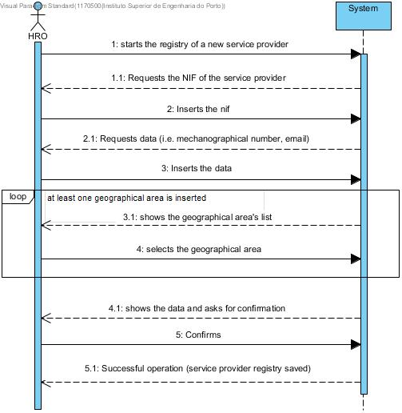

# UC8 - Register Service Provider

## Brief format

The HRO starts the registry of a new service provider. The system requests the NIF of the service provider. The HRO inserts the NIF. **If the application associated to the NIF is valid, the system shows the data of the application (i.e. full name, short name and categories) and asks the HRO to confirm.** The HRO confirms. The system requests the remaining data (i.e. idNumber and the institutionalEmail). The HRO inserts the data. The system shows the geographical areas associated to the company and asks the HRO to choose in which area the service provider will do his services. The HRO selects the geographical area. The selection of the geographical area is repeated while the HRO wants to add more areas. The system shows the data and asks for confirmation. The HRO confirms. The system regists the service provider's data and informs the HRO of the success of the operation.

## SSD

## Complete format

### Primary actor

HRO

### Stakeholders and interests
* **HRO:** pretends to regist the service provider so that he can be able to do the services provided by the company.
* **Service provider:** pretends to have access to the system to be able to perform part of the services.
* **Company:** pretends that the user (service provider) becomes a service provider in order to provide services.
* **Client:** pretends to have his service requests delivered to qualified service providers.

### Preconditions
* The HRO must be logged in the system

### Success Guarantee
* The registry data is saved on the system.

## Main Success Scenario

1. The HRO starts the registry of a new service provider.
2. The system requests the NIF of the service provider.
3. The HRO inserts the NIF.
4. **if the application is valid, the system shows the collected data from the application (i.e. full name, short name and categories) and asks for confirmation.**
5. The HRO confirms.
6. The system requests more data (i.e. idNumber, institutionalEmail). 
7. The HRO inserts the data.
8. The system shows the geographical area list. 
9. The HRO selects the geographical area.
10. Repeat steps 8 to 9 while all the geographical areas aren't inserted (minimum 1).
11. The system validates and shows the data, asking for confirmation.
12. The HRO confirms. 
13. The system **regists the service provider's data** and informs the HRO of the success of the operation. 

### Extensions

*a. The HRO cancels the registry.

> The use case-ends.

**5a.** The HRO doesn't confirm the data colected from the application.

>	1.  The system informs the HRO on the missing data.

>	2.  The system allows the HRO to modify/insert the data.

>	>   2a. The HRO modifies/inserts the data. The use-c-ase ends.

9a. Minimum required data missing

>	1.  The system informs the user of the data missing.

>	2.  The system allows the introduction of the missing data (step 4).

>	>   2a. The HRO doesn't modify the data. The use-case ends.

9b. The system detects that the data inserted must be unique and it already exists in the system.

>	1.  The system informs the HRO.

>	2.  The system allows the user to change (step 4).

>	>   2a. The HRO doesn't modify the data. The use-case ends.

9c. The system detects that the data inserted is invalid.

>	1.  The system informs the HRO.

>	2.  The system allows the user to change (step 4).

>	>   2a. The HRO doesn't modify the data. The use-case ends.

### Special Requirements
\-

### Technology and data variations list
\-

### Frequency of Occurrence
\-

### Miscellaneous

