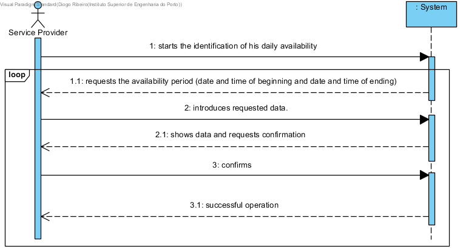

# UC9 - Indicate Daily Availability

## Brief Format

The service provider starts the identification of his daily availability. The system requests the required data (i.e. date/time beginning and ending). The service provider introduces the requested data. The system validates and shows the data to the service provider, asking to confirm them. The service provider confirms. The system records the availability of the service provider and informs the service provider of the success of the operation.

## SSD

## Fully-dressed Format

### Primary actor

Service Provider

### Stakeholders and interests
* **Service Provider:** wants to indicate his daily availability to realize services.
* **Company:** wants that the daily availability of service providers is specified in the system.

### Preconditions
n/a

### Success Guarantee
The information about the daily availability of the service provider is recorded in the system.

## Main Success Scenario (or main flow)

1. The service provider starts the identification of his daily availability.
2. The system requests a period(date and time of beginning and date and time of ending) where the service provider is available to perform services.
3. The service provider introduces the requested data.
4. The system validates and shows the data to the service provider, asking to confirm them. 
5. The service provider confirms. 
6. The system records the availability of the service provider and informs the service provider of the success of the operation.
7. Steps 2 to 6 are repeated until the service provider indicates all his availabilities.

### Extensions (or alternative flows)

*a. The service provider requests the cancellation of the indication of his daily availability.

> The use case ends.
	
4a. Data that identifies the availability period is incomplete.
>	1. The system informs on which data is missing.
>	2. The system allows the introduction of the missing data (step 3).
>
	>	2a. The service provider doens't change de data. The use case ends.

4b. The system detects that the entered data (or some subset of the data) is invalid.
> 1. The system alerts the service provider to the fact.
> 2. The system allows the service provider to change it (step 3).
>
	> 2a. The service provider doens't change the data. The use case ends.
	
4c. The system detects that the indicated availability overlaps (i.e., intercept) with another availability indicated above.
>	1. The system alerts the service provider to the fact.
>	2. The system allows the service provider to change it (step 3).
>
	>	2a. The service provider doens't change the data. The use case ends.

### Special Requirements
\-

### Technology and Data Variations List
\-

### Frequency of Occurrence
\-

### Miscellaneous

* Should the service provider indicate a daily availability for each type of service?
* What is the frequency of occurence of this use case?