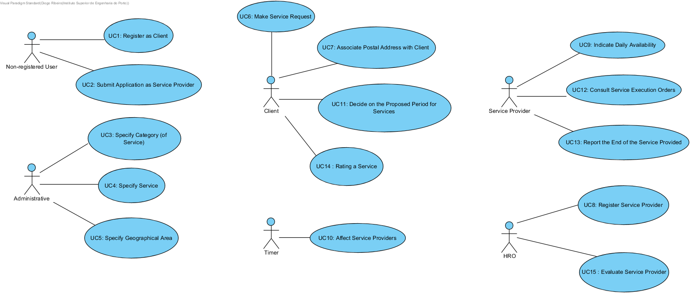

# Use Cases Diagram

# Use Cases
| UC  | Description                                                              |                   
|:----|:------------------------------------------------------------------------|
| UC1 | [Register as Client](UseCases/UC1_RegisterClient.md)   |
| UC2 | [Submit Application as Service Provider](UseCases/UC2_SubmitApplicationServiceProvider.md)|
| UC3 | [Specify Category (of Service)](UseCases/UC3_SpecifyCategory.md)|
| UC4 | [Specify Service](UseCases/UC4_SpecifyService.md)|
| UC5 | [Specify Geographical Area](UseCases/UC5_SpecifyGeographicalArea.md)|
| UC6 | [Make Service Request](UseCases/UC6_MakeServiceRequest.md)|
| UC7 | [Associate Postal Address with Client](UseCases/UC7_AssociatePostalAddressClient.md)|
| UC8 | [Register Service Provider](UseCases/UC8_RegisterServiceProvider.md)  |
| UC9 | [Indicate Daily Availability of Services](UseCases/UC9_IndicateDailyAvailability.md)|
| UC10 | [Affect Service Providers](UseCases/UC10_AffectServiceProviders.md)|
| UC11 | [Decide on the Proposed Period for Services](UseCases/UC11_DecideOnTheProposedPeriodForServices.md)|
| UC12 | [Consult Service Execution Orders](UseCases/UC12_ConsultServiceOrders.md)|
| UC13 | [Report the End of the Service Provided](UseCases/UC13_ReportTheEndOfTheServiceProvided.md)|
| UC14 | [Rating a Service](UseCases/UC14_RatingaService.md)|
| UC15 | [Evaluate Service Provider](UseCases/UC15_EvaluateServiceProvider.md)|
