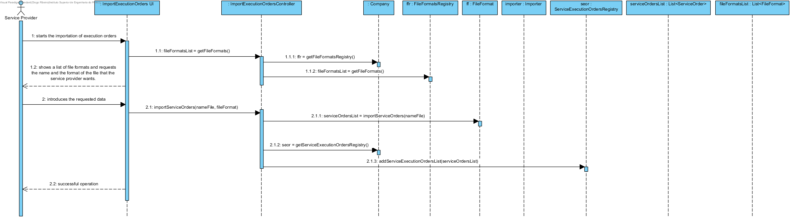
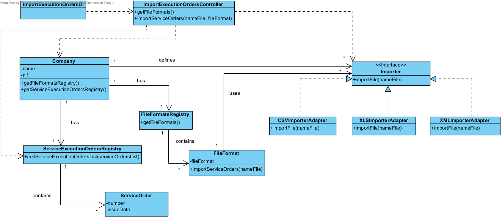

# UC16 Import Service Execution Orders Realization

## Rational

| Main Flow                                            | Question: Which class...                                    | Answer   | Justification                                                                                     |
|:-------------------------------------------------------------------------------------------------------|:------------------------------------------------------------|:-----------------------------------------------|:---------------------------------------------------------------------------------------------------------------------|
| 1. The service provider starts the importation of his service execution orders.| ...interacts with the user? | ImportExecutionOrdersUI | Pure Fabrication |
| | ...coordinates the UC? |ImportExecutionOrdersController|Controller|
| | ...knows the service execution orders?| ServiceExecutionOrdersRegistry | IE: ServiceExecutionOrdersRegistry contains service execution orders |
| | ...knows the ServiceExecutionOrdersRegistry? | Company | HC + LC |
| 2. The system shows a list of file formats and requests the name and the format of the file that the service provider wants.|... knows the file formats?|FileFormat|IE: FileFormat knows all the file formats.|
| | ...knows the FileFormat?| FileFormatsRegistry | IE: FileFormatsRegistry knows all FileFormat |
| | ...knows the FileFormatsRegistry | Company | HC + LC |
| 3. The service provider introduces the requested data.||||
| 4. The system imports the execution orders and informs the service provider of the success of the operation.| ... imports the service execution orders? | Importer | IE: At the MD Importer provides this information.|
| | ...implements the particularities of each particular file format? | ImporterFileXXXAdapter | ProtectedVariation + Adapter |
| | ...saves the imported service execution orders?| ServiceExecutionOrdersRegistry | IE: ServiceExecutionOrdersRegistry contains ServiceOrder|
| | ...notifies the user? | ImportExecutionOrdersUI | | |

## Systematization ##

  From the rational results that the conceptual classes promoted to software classes are:

 * Company
 * ServiceOrder
 * Importer
 * FileFormat

Other software classes (i.e. Pure Fabrication) identified: 

 * ImportExecutionOrdersUI
 * ImportExecutionOrdersController
 * ServiceExecutionOrdersRegistry
 * FileFormatsRegistry

## Sequence Diagram

## Class Diagram
