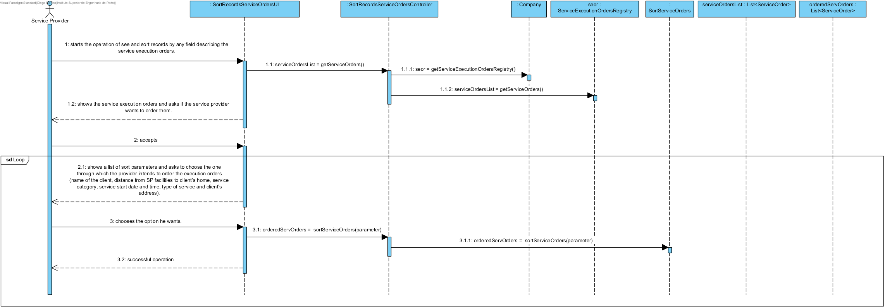
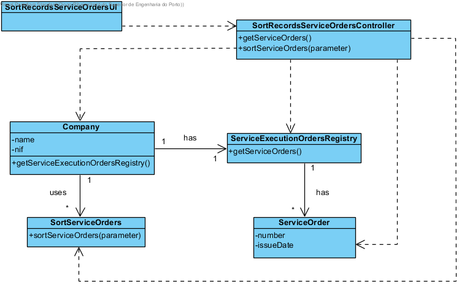

# UC17 See and Sort Records by any Field Describing the Service Execution Orders Realization

## Rational

| Main flow                                                                                        | Question: Which Class...                                      | Answer                                       | Justification                                                                                                         |
|:-------------------------------------------------------------------------------------------------------|:------------------------------------------------------------|:-----------------------------------------------|:---------------------------------------------------------------------------------------------------------------------|
|1. The service provider starts the operation of see and sort records by any field describing the service execution orders. |... interacts with the user?|SortRecordsServiceOrdersUI|PureFabrication|
||...coordinates the UC?|SortRecordsServiceOrdersController|Controller|
|2. The system shows the service execution orders and asks if the service provider wants to order them. | ... knows the service execution orders?|ServiceExecutionOrdersRegistry | IE: ServiceExecutionOrdersRegistry contains service execution orders |
|| ... knows the ServiceExecutionOrdersRegistry? | Company | HC + LC |
|3. The service provider accepts.||||
|4. The system shows a list of sort parameters and asks to choose the one through which the provider intends to order the execution orders (name of the client, distance from SP facilities to client’s home, service category, service start date and time, type of service and client’s address). ||||
|5. The service provider chooses the data he wants.||||
|6. The system orders the service execution orders, shows to the service provider and informs him of the success of the operation.| ...orders the service execution orders?| SortServiceOrders | IE: SortServiceOrders orders service execution orders|
|| ... notifies the user?  | SortRecordsServiceOrdersUI | |
|7. The steps 4 to 6 are repeated until the service provider wants.||||                                               

## Systematization ##

 From the rational results that the conceptual classes promoted to software classes are:

 * Company
 * ServiceOrder
 * SortServiceOrders

Other software classes (i.e. Pure Fabrication) identified: 

 * SortRecordsServiceOrdersUI  
 * SortRecordsServiceOrdersController
 * ServiceExecutionOrdersRegistry

##	Sequence Diagram

##	Class Diagram

