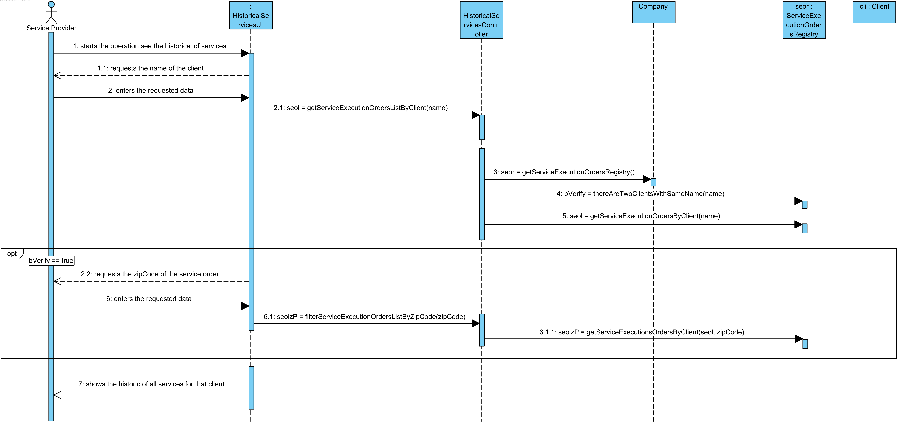
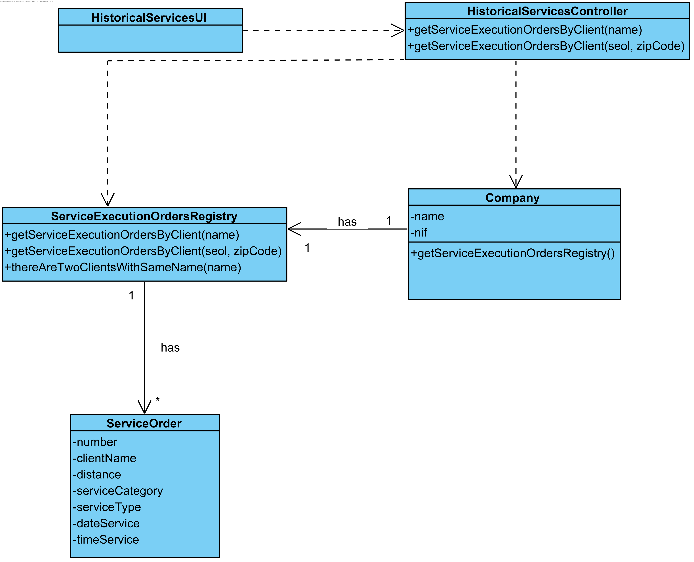

# UC18 See Historical Services By Client Realization

## Rational

| Main flow                                                                                        | Question: Which Class...                                      | Answer                                      | Justification                                                                                                         |
|:-------------------------------------------------------------------------------------------------------|:------------------------------------------------------------|:-----------------------------------------------|:---------------------------------------------------------------------------------------------------------------------|
| 1. The service provider starts the operation to see the historical of services by client.| ...interacts with the user?| HistoricalServicesUI| PureFabrication |
||...coordinates the UC?|HistoricalServicesController| Controller |
| 2. The systems requests the name of the client. SP enters the requested data.|...knows the ClientsRegistry|Company|HC + LC|
||... knows the client?|ClienstRegistry|IE: The ClientsRegistry contains Clients|
|3. SP enters the requested data.|||
| 4. The system requires aditional data, if necessary. |...knows if it's necessary more data?|ServiceExecutionOrdersRegistry|IE: ServiceExecutionOrdersRegistry contains ServiceExecutionOrders|
||... knows the Client's name on the Service Execution Order?|ServiceExecutionOrder| IE: ServiceExecutionOrder has is own data.|
| 5. SP enters the request data. |
| 6. The system validates the data and shows the historic of all services for that client.|...  validates the data?|HistoricalServicesController||
||... knows all ServiceExecutionOrders?|ServiceExecutionOrdersRegistry||

## Systematization ##

 From the rational results that the classes promoted to software classes are:

 * Company
 * ServiceRequestDescription

Other indentified software classes (i.e. Pure Fabrication) are:  

 * HistoricalServicesUI
 * HistoricalServicesController
 * ClientsRegistry
 * ServiceExecutionOrdersRegistry

##	Sequence Diagram

##	Class Diagram

