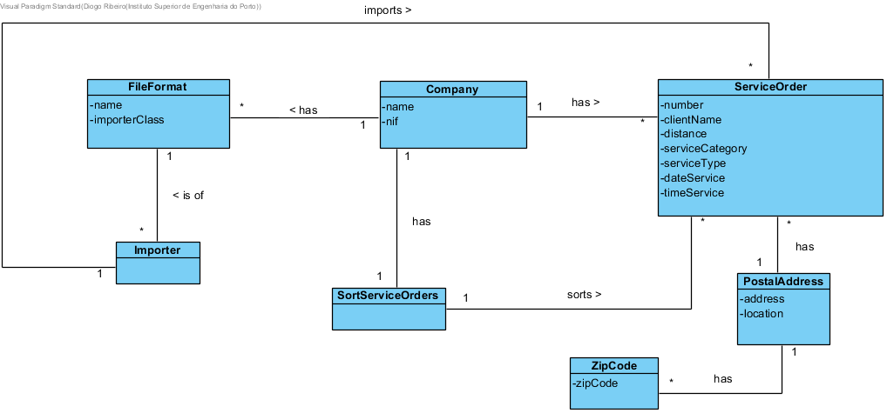

# OO Analysis #
The process of constructing of the domain model is based on the use cases, especially the nouns used, and on the description of the assignment.

## Rationale for the identification of the domain classes ##
For a classification of the domain classes, we use a list of functions of the TP classes (suggested in the book). As a result we have the following table of concepts (or classes, but not software) by category.

### _Categories List_ ###

**Transactions (of business)**

---

**Lines of transactions**

---

**Products or services related to transactions**

---

**Records (of transactions)**

---  

**Peoples's roles**

* Service Provider

---

**Places**

*  Postal Address
*  Zip Code

---

**Events**

*

---

**Physical objects**

*

---

**Specifications and descriptions**

*  File Format

---

**Catalogs**

*  

---

**Sets**

*  

---

**Elements of Sets**

*  

---

**Organizations**

*  Company

---

**Other systems (external)**

* Importer

---

**Records (financial), work, contracts, legal documents**

*

---

**Financial instruments**

*  

---

**Referred documents / to perform the tasks /**

---

###**Rationale on identifying associations between classes**###

An association is a relationship between instances of objects that indicates a relevant connection that is worth remembering, or is derivable from the List of Common Associations:

+ A is physically (or logically) part of B
+ A is physically (or logically) contained in B
+ A is a description of B
+ A is known / captured / recorded by B
+ A uses or generates B
+ A is related to a transaction of B + etc.

| Concept (A) 		|  Association  		|  Concept (B) |
|----------	   		|:-------------:		|------:       |
| Company | has | Service Order  |
|	| has | Sort Service Orders  |
| | has |  File Format  |
| Service Order  | is imported by | Importer  |
| | has | Postal Address
| | is sorted by | Sort Service Orders |
| Postal Address | has | Zip Code |
| Importer | is of | File Format |
| | imports | Service Order |

## Domain Model

