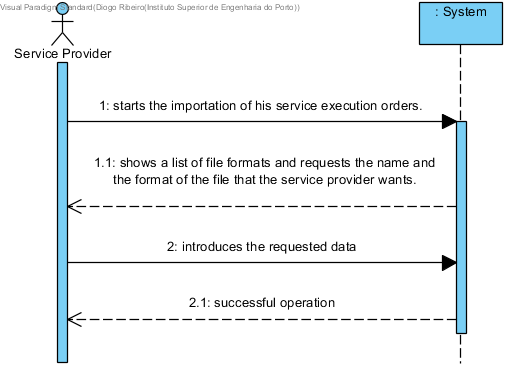

# UC16 - Import Service Execution Orders

## Brief Format

The service provider starts the importation of his service execution orders. The system shows a list of file formats and requests the name and the format of the file that the service provider wants. The service provider introduces the requested data. The system validates and imports the service execution orders and informs the service provider of the success of the operation.

## SSD

## Fully-dressed Format

### Primary Actor

Service Provider

### Stakeholders and interests
* **Service Provider:** pretends to import his service execution orders.

### Preconditions
n/a

### Success Guarantee
The information of the service execution orders is recorded in the system.

## Main Success scenario

1. The service provider starts the importation of his service execution orders.
2. The system shows a list of file formats and requests the name and the format of the file that the service provider wants. 
3. The service provider introduces the requested data.
4. The system validates and imports the service execution orders and informs the service provider of the success of the operation.

### Extensions

*a. The service provider requests the cancellation of the importation of his service execution orders.

> The use case ends.

4a. Required minimum data missing.
>	1. The system informs on which data is missing.
>	2. The system allows the introduction of the missing data (step 2)
>
	>	2a. The service provider doesn't change the data. The use case ends.

4b. The system detects that the entered data (or some subset of the data) is invalid.
> 1. The system alerts the service provider to the fact.
> 2. The system allows the service provider to change it (step 2).
> 
	> 2a. The service provider doesn't change the data. The use case ends.

### Special Requirements
\-

### Technology and Data Variations List
\-

### Frequency of Occurrence
\-

### Miscellaneous

* What's the frequency of occurrence of this use case?