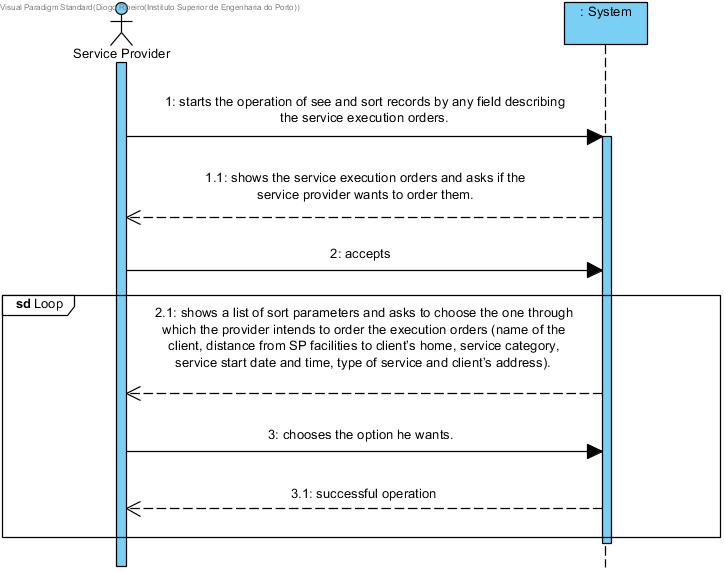

# UC17 - See and Sort Records by any Field Describing the Service Execution Orders

## Brief Format

The service provider starts the operation of see and sort records by any field describing the service execution orders. The system shows the service execution orders and asks if the service provider wants to order them. The service provider accepts. The system shows a list of sort parameters and asks to choose the one through which the provider intends to order the execution orders (name of the client, distance from SP facilities to client’s home, service category, service start date and time, type of service and client’s address). The service provider chooses the option he wants. The system orders the service execution orders, shows to the service provider and informs him of the success of the operation.

## SSD

## Fully-dressed Format

### Primary actor

Service Provider

### Stakeholders and interests
* **Service provider:** wants to sort records by any field describing his service execution orders.

### Preconditions
n/a

### Success Guarantee
n/a

## Main Success Scenario (or main flow)

1. The service provider starts the operation of see and sort records by any field describing the service execution orders. 
2. The system shows the service execution orders and asks if the service provider wants to order them. 
3. The service provider accepts. 
4. The system shows a list of sort parameters and asks to choose the one through which the provider intends to order the execution orders (name of the client, distance from SP facilities to client’s home, service category, service start date and time, type of service and client’s address). 
5. The service provider chooses the option he wants. 
6. The system orders the service execution orders, shows to the service provider ans informs him of the success of the operation.
7. The steps 4 to 6 are repeated until the service provider wants.

### Extensions (or alternative flows)

2a. There aren't any service execution orders defined in the system.
>   1. The system warns the service provider for that.
>   2. The system allows the importation of his service execution orders (UC16).
> 
    > 2a. The service provider doens't import the service execution orders. The use case ends.
	
2b. The service provider doens't want to order the service execution orders.

> The use case ends.

### Special Requirements
\-

### Technology and Data Variations List
\-

### Frequency of Occurrence
\-

### Miscellaneous

* How often does this use case occur?