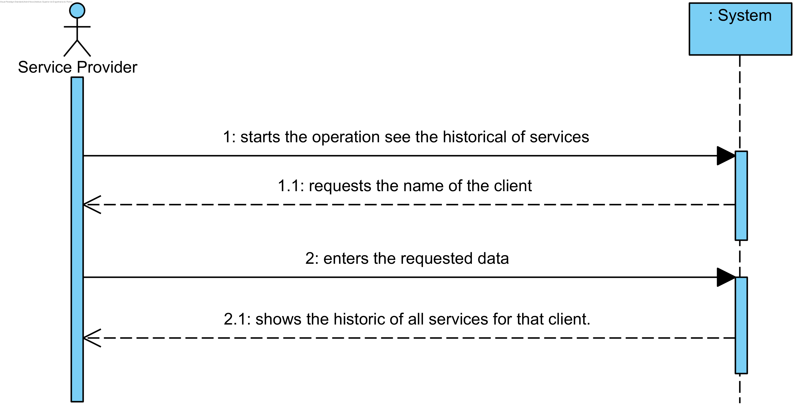

# UC18 - See Historical Services By Client

## Brief Format

The service provider starts the operation to see the historical of services by client. The systems requests the name of the client. SP enters the requested data. The system validates the data and shows the historic of all services for that client.

## SSD

## Fully-dressed Format

### Primary actor

Service Provider

### Stakeholders and Interests
* **Service Provider:** wants to see his historical services per client.

### Preconditions
n/a

### Success Guarantee

## Main Success Scenario

1. The service provider starts the operation to see the historical of services by client.
2. The systems requests the name of the client. 
3. SP enters the requested data.
4. The system requires aditional data, if necessary.
5. SP enters the request aditional data.
6. The system validates the data and shows the historic of all services for that client.

### Extensions

*a. The SP wants to cancel the operation to see the historical of services by client.
    > The use case ends.

1a. There aren't any services performed by the SD.
> 1. The system warns the SP for that. The use case ends.

6a. There aren't any services performed by the SD for that client.
> 1. The system warns the SP for that. The use case ends.

### Special Requirements
\-

### Technology and Data Variations List
\-

### Frequency of Occurrence
\-

### Miscellaneous

* Shouldn't we use a more restricted identifier?
* What is the frequency of occurence of this use case?