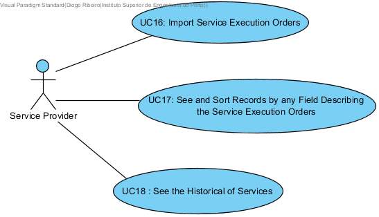

# Use Cases Diagram

# Use Cases
| UC  | Description                                                              |                   
|:----|:------------------------------------------------------------------------|
| UC16 | [Import Service Execution Orders](UseCases/UC16_ImportServiceExecutionOrders.md)   |
| UC17 | [See and Sort Records by any Field Describing the Service Execution Orders](UseCases/UC17_SeeAndSortRecordsByAnyFieldDescribingServiceExecutionOrders.md)|
| UC18 | [See the Historical of Services](UseCases/UC18_HistoricalServicesByClient.md)|
